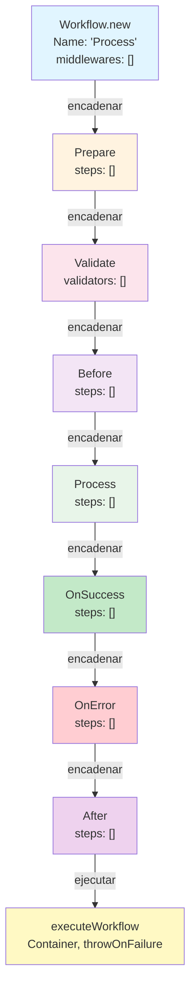
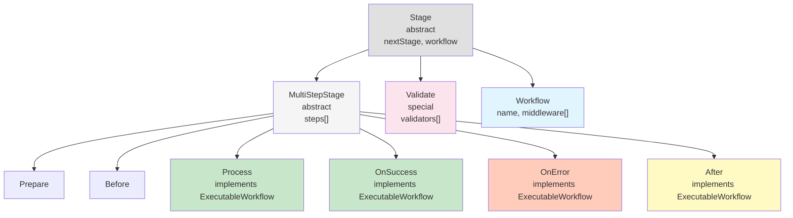

## 1. Objetivo

Este documento proporciona un análisis técnico exhaustivo del proceso de creación y definición de workflows en la librería **php-workflow**, describiendo cómo se estructura un flujo de trabajo desde su instanciación hasta su ejecución. Se limita a documentar la creación, registro y estructura del workflow, omitiendo deliberadamente la implementación de la lógica interna de los pasos (`WorkflowStep`).

El propósito es comprender la arquitectura global, las clases involucradas, el flujo de información y cómo se orquesta la ejecución sin necesidad de conocer los detalles específicos de qué y cómo hace cada paso.

---

## 2. Contexto del Proyecto

### Tipo de Arquitectura

**php-workflow** implementa una arquitectura de **flujos de trabajo orientada a etapas controladas**, basada en el patrón **Pipeline** (cadena de responsabilidad) con stages predefinidos.

### Patrón Utilizado

El proyecto utiliza múltiples patrones de diseño:

1. **Pipeline Pattern**: Las etapas se encadenan secuencialmente, cada una delegando al siguiente.
2. **Command Object Pattern**: Los pasos (`WorkflowStep`) actúan como comando desacoplados de su contexto.
3. **State Machine**: El flujo transita por estados predefinidos (Prepare → Validate → Before → Process → OnSuccess/OnError → After).
4. **Trait Composition**: Utiliza traits para composición y reutilización de funcionalidad (ej: `AllowNextPrepare`, `AllowNextValidator`).
5. **Container Pattern**: `WorkflowContainer` actúa como contenedor de datos compartidos entre pasos.

### Organización de Carpetas

```
src/
├── Workflow.php                    # Clase principal de definición
├── ExecutableWorkflow.php          # Interfaz de ejecución
├── Validator.php                   # Encapsulador de validadores
├── WorkflowControl.php             # Control de flujo desde dentro de los pasos
├── Exception/                      # Excepciones del sistema
│   ├── WorkflowException.php
│   ├── WorkflowValidationException.php
│   ├── WorkflowControl/            # Excepciones de control (Skip, Fail, etc.)
│   │   ├── SkipStepException.php
│   │   ├── FailStepException.php
│   │   ├── FailWorkflowException.php
│   │   ├── SkipWorkflowException.php
│   │   └── ...
├── Stage/                          # Etapas del flujo
│   ├── Stage.php                   # Clase base abstracta
│   ├── MultiStepStage.php          # Clase base para etapas multi-pasos
│   ├── Prepare.php                 # Etapa de preparación
│   ├── Validate.php                # Etapa de validación
│   ├── Before.php                  # Etapa previa al proceso
│   ├── Process.php                 # Etapa de procesamiento principal
│   ├── OnSuccess.php               # Etapa de éxito
│   ├── OnError.php                 # Etapa de error
│   ├── After.php                   # Etapa posterior
│   └── Next/                       # Traits de encadenamiento
│       ├── AllowNextPrepare.php
│       ├── AllowNextValidator.php
│       ├── AllowNextBefore.php
│       ├── AllowNextProcess.php
│       ├── AllowNextOnSuccess.php
│       ├── AllowNextOnError.php
│       ├── AllowNextAfter.php
│       └── AllowNextExecuteWorkflow.php
├── Step/                           # Definición y control de pasos
│   ├── WorkflowStep.php            # Interfaz de pasos
│   ├── StepExecutionTrait.php      # Lógica de ejecución de pasos
│   ├── NestedWorkflow.php          # Pasos que contienen workflows anidados
│   ├── Loop.php                    # Pasos que generan bucles
│   └── Dependency/                 # Validación de dependencias
├── State/                          # Gestión de estado
│   ├── WorkflowState.php           # Estado completo del workflow durante ejecución
│   ├── WorkflowContainer.php       # Contenedor de datos compartidos
│   ├── WorkflowResult.php          # Resultado final de la ejecución
│   └── ExecutionLog/               # Registros de ejecución
│       ├── ExecutionLog.php
│       ├── Describable.php
│       └── OutputFormat/
├── Middleware/                     # Middleware de ejecución
│   ├── ProfileStep.php             # Profiling de pasos
│   └── WorkflowStepDependencyCheck.php  # Validación de dependencias
```

### Rol de los Workflows en el Sistema

Los workflows en php-workflow son **definiciones estructuradas de procesos de negocio**, donde cada proceso se compone de:

- **Etapas predefinidas** que se ejecutan en un orden específico
- **Pasos independientes** inyectados en cada etapa
- **Validaciones** que pueden ser duras (detienen el flujo) o suaves (registran advertencias)
- **Manejo de excepciones** mediante etapas OnSuccess/OnError
- **Trazabilidad completa** mediante registros de ejecución

Un workflow **NO controla la lógica de negocio** de cada paso (eso lo hace el `WorkflowStep`), sino que orquesta la **secuencia, las condiciones y el estado global** del proceso.

---

## 3. ¿Qué es un Workflow en Este Proyecto?

### Definición Conceptual

Un **Workflow** es una instancia de la clase `Workflow` que representa un **proceso de negocio estructurado en etapas controladas**. Es un objeto que:

1. **Se crea con un nombre único** que identifica el proceso
2. **Encadena etapas predefinidas** en un orden específico
3. **Acumula pasos** (`WorkflowStep`) en cada etapa según sea necesario
4. **Mantiene estado compartido** mediante un `WorkflowContainer`
5. **Se ejecuta** llamando a `executeWorkflow()`, generando un `WorkflowResult`
6. **Genera registros trazables** mediante `ExecutionLog`

### Características Clave

- **Immutable en su definición**: Se define de forma declarativa mediante encadenamiento de métodos
- **Reusable**: Puede ejecutarse múltiples veces con diferentes `WorkflowContainer`
- **Testeable**: Cada pasos es independiente y el workflow es facilmente verificable
- **Debuggable**: Proporciona registros detallados de cada etapa y paso
- **Controlable**: Permite saltar, fallar o continuar desde dentro de los pasos

### Representación en Código

```php
$workflowResult = (new Workflow('MiProceso'))
    ->prepare($pasoPreparacion)
    ->validate($validador1)
    ->validate($validador2, true)  // true = hard validator
    ->before($pasoAnterior)
    ->process($pasoPrincipal1)
    ->process($pasoPrincipal2)
    ->onSuccess($pasoExito)
    ->onError($pasoError)
    ->after($pasoPosterior)
    ->executeWorkflow($contenedor, $lanzarEnFallo);
```

La variable `$workflowResult` es una instancia de `WorkflowResult` que contiene el estado del workflow tras su ejecución.

---

## 4. Proceso para Crear un Workflow (Sin Pasos)

### Descripción Detallada del Proceso

El proceso de creación de un workflow en php-workflow se divide en las siguientes fases:

---

#### Fase 1: Instanciación

**Archivo responsable**: `src/Workflow.php`  
**Clase**: `PHPWorkflow\Workflow`

```php
$workflow = new Workflow('NombreProceso');
```

**Lo que sucede**:
- Se crea una instancia de la clase `Workflow`
- Se acepta un parámetro `$name` (string) que identifica el workflow
- Se acepta opcionales `...$middlewares` (callables) que se ejecutarán en cada paso
- Se hereda de la clase `Stage` (la clase base de todas las etapas)
- Se inicializa el atributo `nextStage` como `null` (será asignado al encadenar etapas)

**Arquitectura interna**:
- `Workflow` extiende `Stage`
- `Workflow` utiliza traits que definen los métodos de encadenamiento: `AllowNextPrepare`, `AllowNextValidator`, `AllowNextBefore`, `AllowNextProcess`

---

#### Fase 2: Encadenamiento de Etapas

**Archivos responsables**:
- `src/Stage/Next/AllowNext*.php` (traits que definen los métodos de encadenamiento)
- `src/Stage/Prepare.php`, `Validate.php`, `Before.php`, `Process.php`, `OnSuccess.php`, `OnError.php`, `After.php`

**Lo que sucede**:

Cada llamada a un método de encadenamiento (ej: `->prepare()`, `->validate()`, `->before()`) realiza las siguientes acciones:

1. **Crea una nueva instancia de la etapa correspondiente**:
   ```php
   $newStage = new Prepare($this->workflow);
   ```

2. **Encadena la nueva etapa a la anterior**:
   ```php
   $this->nextStage = $newStage;
   ```

3. **Devuelve la nueva etapa** para permitir el encadenamiento (fluent interface):
   ```php
   return $newStage;  // Permite ->prepare(...)->validate(...)->...
   ```

**Orden de las etapas** (definido por los traits disponibles en cada etapa):

```
Workflow
  └─> AllowNextPrepare ────> Prepare
        AllowNextValidator ──> Validate
        AllowNextBefore ────> Before
        AllowNextProcess ────> Process
        AllowNextOnSuccess ──> OnSuccess
        AllowNextOnError ────> OnError
        AllowNextAfter ────> After
        AllowNextExecuteWorkflow
```

**Restricciones de encadenamiento**:

Cada etapa define qué etapas pueden venir después mediante traits específicos. Esto crea un orden predefinido e inmutable:

| Etapa | Puede ser seguida por |
|-------|----------------------|
| `Workflow` | `->prepare()`, `->validate()`, `->before()`, `->process()` |
| `Prepare` | `->validate()`, `->before()`, `->process()` |
| `Validate` | `->before()`, `->process()` |
| `Before` | `->process()` |
| `Process` | `->onSuccess()`, `->onError()`, `->after()`, `->executeWorkflow()` |
| `OnSuccess` | `->onError()`, `->after()`, `->executeWorkflow()` |
| `OnError` | `->after()`, `->executeWorkflow()` |
| `After` | `->executeWorkflow()` |

---

#### Fase 3: Inyección de Pasos

**Archivos responsables**:
- `src/Stage/MultiStepStage.php` (clase base para etapas que contienen múltiples pasos)
- `src/Step/WorkflowStep.php` (interfaz que implementan todos los pasos)

**Lo que sucede**:

Cuando se llama a un método como `->prepare($paso)`, `->validate($paso)`, etc.:

1. **El paso se añade a la etapa actual**:
   ```php
   // Dentro de Prepare.php
   public function prepare(WorkflowStep $step): self
   {
       return $this->addStep($step);  // Añade $step al array $steps
   }
   ```

2. **El paso se almacena en un array interno**:
   ```php
   // Dentro de MultiStepStage.php
   private array $steps = [];
   
   protected function addStep(WorkflowStep $step): self
   {
       $this->steps[] = $step;
       return $this;
   }
   ```

3. **La etapa se devuelve** para permitir encadenamiento adicional de pasos o etapas

**Cantidad de pasos por etapa**: Una etapa puede contener **múltiples pasos** en la misma llamada de encadenamiento:

```php
$workflow
    ->prepare($paso1)
    ->prepare($paso2)
    ->prepare($paso3)  // Produce: Prepare { steps: [paso1, paso2, paso3] }
```

---

#### Fase 4: Validadores Especiales

**Archivo responsable**: `src/Validator.php`  
**Clase**: `PHPWorkflow\Validator`

La etapa `Validate` tiene un comportamiento especial:

```php
->validate($validador, $hardValidator = false)
```

- **$validador**: Un `WorkflowStep` que implementa la lógica de validación
- **$hardValidator**: Un booleano que indica si es validador "duro"

**Diferencia entre validadores duros y suaves**:

- **Hard validators** (duros):
  - Se ejecutan primero
  - Si fallan, detienen inmediatamente el workflow
  - Las excepciones se propagan sin capturarse

- **Soft validators** (suaves):
  - Se ejecutan después de los duros
  - Si fallan, se registra el error pero el workflow continúa
  - Las excepciones se acumulan en un `WorkflowValidationException`

**Encapsulación interna**:

En la etapa `Validate`, cada validador se envuelve en una instancia de `Validator`:

```php
// Dentro de Validate.php
public function validate(WorkflowStep $step, bool $hardValidator = false): self
{
    $this->validators[] = new Validator($step, $hardValidator);
    return $this;
}
```

---

#### Fase 5: Preparación y Ejecución

**Archivos responsables**:
- `src/Stage/Next/AllowNextExecuteWorkflow.php` (trait que implementa `executeWorkflow()`)
- `src/State/WorkflowState.php` (gestión del estado durante la ejecución)
- `src/State/WorkflowContainer.php` (contenedor de datos compartidos)
- `src/State/WorkflowResult.php` (resultado de la ejecución)

**Lo que sucede**:

Cuando se llama a `->executeWorkflow()`:

1. **Se crea o se utiliza un contenedor existente**:
   ```php
   if (!$workflowContainer) {
       $workflowContainer = new WorkflowContainer();
   }
   ```

2. **Se crea un estado de workflow**:
   ```php
   $workflowState = new WorkflowState($workflowContainer);
   ```

3. **Se inicia el registro de ejecución**:
   ```php
   $workflowState->getExecutionLog()->startExecution();
   ```

4. **Se ejecutan las etapas en secuencia**:
   ```php
   $this->workflow->runStage($workflowState);
   ```

5. **Se cierra el estado y se devuelve el resultado**:
   ```php
   return $workflowState->close(true);  // o close(false, $exception)
   ```

---

### Resumen del Flujo Técnico Simplificado

```
Instanciación
    ↓
Encadenamiento de etapas (creación de linked list)
    ↓
Inyección de pasos en etapas
    ↓
Llamada a executeWorkflow()
    ↓
Creación de WorkflowState y WorkflowContainer
    ↓
Iteración secuencial sobre etapas
    ↓
Ejecución de pasos dentro de cada etapa
    ↓
Captura de excepciones y estado
    ↓
Generación de WorkflowResult
```

---

## 5. Archivos Involucrados y Función

### Grupo 1: Definición Principal

#### `src/Workflow.php`
- **Tipo**: Clase
- **Responsabilidad**: Punto de entrada de la definición del workflow. Es el objeto que inicia el encadenamiento de etapas.
- **Herencia**: Extiende `Stage`
- **Dependencias**: Utiliza `AllowNextPrepare`, `AllowNextValidator`, `AllowNextBefore`, `AllowNextProcess`
- **Por qué existe**: Proporciona la interfaz declarativa para construir workflows mediante método fluent.
- **Métodos públicos principales**:
  - `__construct(string $name, callable ...$middlewares)`: Crea el workflow
  - `prepare()`, `validate()`, `before()`, `process()`: Métodos de encadenamiento heredados desde traits

---

### Grupo 2: Etapas (Stages)

#### `src/Stage/Stage.php`
- **Tipo**: Clase abstracta
- **Responsabilidad**: Base de todas las etapas. Define estructuras comunes y comportamiento core.
- **Atributos**: 
  - `$nextStage`: La siguiente etapa en el encadenamiento
  - `$workflow`: Referencia al workflow raíz
- **Por qué existe**: Proporciona estructura base para que todas las etapas se comporten consistentemente.
- **Es usado por**: Todas las etapas (`Prepare`, `Validate`, `Before`, etc.)

#### `src/Stage/MultiStepStage.php`
- **Tipo**: Clase abstracta que extiende `Stage`
- **Responsabilidad**: Base para etapas que pueden contener múltiples pasos (`Prepare`, `Before`, `Process`, etc.)
- **Atributos**:
  - `$steps`: Array de `WorkflowStep` inyectados
- **Método protegido**: `addStep(WorkflowStep $step)`: Añade un paso al array
- **Por qué existe**: Evita duplicación de código en etapas multi-paso.
- **Es usado por**: `Prepare`, `Before`, `Process`, `OnSuccess`, `OnError`, `After`

#### `src/Stage/Prepare.php`
- **Tipo**: Clase que extiende `MultiStepStage`
- **Responsabilidad**: Etapa de preparación, ejecución previa a validación
- **Permite siguiente**: `Validate`, `Before`, `Process`
- **Constante**: `STAGE = WorkflowState::STAGE_PREPARE`
- **Por qué existe**: Proporciona punto de extensión para preparativos previos a la validación

#### `src/Stage/Validate.php`
- **Tipo**: Clase que extiende `Stage` (NO `MultiStepStage`)
- **Responsabilidad**: Etapa de validación con soporte para validadores duros y suaves
- **Atributos**: `$validators[]` (array de `Validator`)
- **Permite siguiente**: `Before`, `Process`
- **Por qué existe**: Maneja validaciones con lógica especial de hard vs soft validators
- **Comportamiento especial**: Ordena hard validators primero, captura excepciones de soft validators

#### `src/Stage/Before.php`
- **Tipo**: Clase que extiende `MultiStepStage`
- **Responsabilidad**: Etapa de preparación inmediata previa al procesamiento
- **Permite siguiente**: `Process`
- **Por qué existe**: Último punto de preparación antes del procesamiento crítico

#### `src/Stage/Process.php`
- **Tipo**: Clase que extiende `MultiStepStage`, implementa `ExecutableWorkflow`
- **Responsabilidad**: Etapa principal de procesamiento
- **Permite siguiente**: `OnSuccess`, `OnError`, `After`, `ExecuteWorkflow`
- **Captura excepciones**: Las excepciones en esta etapa se registran en `$workflowState->processException`
- **Por qué existe**: Es el núcleo del workflow donde ocurre la lógica principal

#### `src/Stage/OnSuccess.php`
- **Tipo**: Clase que extiende `MultiStepStage`, implementa `ExecutableWorkflow`
- **Responsabilidad**: Etapa de post-procesamiento en caso de éxito
- **Permite siguiente**: `OnError`, `After`, `ExecuteWorkflow`
- **Condicional**: Solo se ejecuta si `$workflowState->getProcessException()` es nulo
- **Por qué existe**: Permite acciones específicas cuando el proceso fue exitoso

#### `src/Stage/OnError.php`
- **Tipo**: Clase que extiende `MultiStepStage`, implementa `ExecutableWorkflow`
- **Responsabilidad**: Etapa de post-procesamiento en caso de error
- **Permite siguiente**: `After`, `ExecuteWorkflow`
- **Condicional**: Solo se ejecuta si `$workflowState->getProcessException()` NO es nulo
- **Por qué existe**: Permite acciones de recuperación o logging cuando el proceso falla

#### `src/Stage/After.php`
- **Tipo**: Clase que extiende `MultiStepStage`, implementa `ExecutableWorkflow`
- **Responsabilidad**: Etapa de finalización, se ejecuta siempre (éxito o error)
- **Permite siguiente**: `ExecuteWorkflow`
- **Por qué existe**: Cierre y limpieza necesaria independientemente del resultado

---

### Grupo 3: Traits de Encadenamiento (Next)

#### `src/Stage/Next/AllowNextPrepare.php` hasta `AllowNextExecuteWorkflow.php`
- **Tipo**: Traits
- **Responsabilidad**: Definen qué etapa puede venir después de la actual
- **Comportamiento**: Cada trait proporciona un método (ej: `prepare()`, `validate()`) que:
  1. Crea una nueva instancia de la etapa siguiente
  2. La asigna a `$this->nextStage`
  3. La devuelve para encadenamiento
- **Por qué existen**: Proporcionan restricciones de encadenamiento a nivel de tipo (los IDEs y linters pueden validar el orden)
- **Ejemplo**:
  ```php
  trait AllowNextPrepare {
      public function prepare(WorkflowStep $step): Prepare {
          return $this->nextStage = (new Prepare($this->workflow))->prepare($step);
      }
  }
  ```

---

### Grupo 4: Pasos (Steps)

#### `src/Step/WorkflowStep.php`
- **Tipo**: Interfaz
- **Responsabilidad**: Define el contrato que deben implementar todos los pasos
- **Métodos**:
  - `run(WorkflowControl $control, WorkflowContainer $container): void`: Ejecuta la lógica del paso
  - Hereda de `Describable` (para generar descripciones en registros)
- **Por qué existe**: Proporciona un contrato desacoplado que cualquier paso debe cumplir

#### `src/Step/StepExecutionTrait.php`
- **Tipo**: Trait
- **Responsabilidad**: Lógica de ejecución de pasos, envolvimiento de excepciones, registro de ejecución
- **Método principal**: `wrapStepExecution(WorkflowStep $step, WorkflowState $state)`
- **Por qué existe**: Centraliza la lógica de ejecución reutilizable en todas las etapas

#### `src/Step/NestedWorkflow.php`
- **Tipo**: Clase que implementa `WorkflowStep`
- **Responsabilidad**: Permite inyectar workflows como pasos dentro de otros workflows
- **Por qué existe**: Proporciona composición de workflows (workflows anidados)

#### `src/Step/Loop.php`
- **Tipo**: Clase que implementa `WorkflowStep`
- **Responsabilidad**: Permite crear bucles dentro de un workflow
- **Por qué existe**: Proporciona iteración controlada

---

### Grupo 5: Gestión de Validadores

#### `src/Validator.php`
- **Tipo**: Clase wrapper
- **Responsabilidad**: Encapsula un **paso** que actúa como validador, junto con su tipo (duro o suave)
- **Atributos**:
  - `$step`: La instancia de `WorkflowStep` que valida
  - `$hardValidator`: Booleano indicando si es validador duro
- **Por qué existe**: Permite diferenciar comportamiento de validadores sin modificar `WorkflowStep`

---

### Grupo 6: Estado y Resultado

#### `src/State/WorkflowContainer.php`
- **Tipo**: Clase contenedor
- **Responsabilidad**: Almacena y proporciona acceso a datos compartidos entre pasos
- **Métodos principales**:
  - `get(string $key)`: Obtiene un valor
  - `set(string $key, $value)`: Establece un valor
  - `has(string $key)`: Verifica existencia
  - `unset(string $key)`: Elimina un valor
- **Por qué existe**: Proporciona un mecanismo desacoplado para compartir estado entre pasos

#### `src/State/WorkflowState.php`
- **Tipo**: Clase de estado interno
- **Responsabilidad**: Mantiene el estado completo del workflow durante su ejecución
- **Atributos principales**:
  - `$processException`: Excepción capturada durante Process
  - `$workflowName`: Nombre del workflow
  - `$stage`: Etapa actual
  - `$workflowControl`: Instancia de `WorkflowControl`
  - `$workflowContainer`: Referencia al contenedor
  - `$executionLog`: Registro de ejecución
- **Por qué existe**: Centraliza el estado de forma que todas las etapas y pasos puedan acceder a él de forma consistente
- **Es usado por**: Todas las etapas durante la ejecución

#### `src/State/WorkflowResult.php`
- **Tipo**: Clase resultado
- **Responsabilidad**: Encapsula el resultado final de la ejecución del workflow
- **Atributos**:
  - `$success`: Booleano indicando si fue exitoso
  - `$exception`: Exception si falló
  - `$workflowState`: Referencia al estado final
- **Métodos principales**:
  - `success()`: Verifica si fue exitoso
  - `getException()`: Obtiene la excepción
  - `debug()`: Genera registro de depuración
  - `getContainer()`: Accede al contenedor final
- **Por qué existe**: Proporciona una interfaz limpia para acceder a los resultados sin exponer el WorkflowState interno

---

### Grupo 7: Control de Ejecución

#### `src/WorkflowControl.php`
- **Tipo**: Clase de control
- **Responsabilidad**: Proporciona métodos para que los pasos controlen el flujo
- **Métodos principales**:
  - `skipStep(string $reason)`: Salta el paso actual
  - `failStep(string $reason)`: Falla el paso actual
  - `failWorkflow(string $reason)`: Falla el workflow completo
  - `skipWorkflow(string $reason)`: Salta el workflow
  - `continue(string $reason)`: Continúa en bucles (o salta el paso)
  - `break(string $reason)`: Rompe bucles (o salta el paso)
- **Por qué existe**: Permite que los pasos (que no tienen acceso al estado interno) puedan influir en el flujo

#### `src/WorkflowControl.php` → Excepciones
- **Archivo**: `src/Exception/WorkflowControl/*.php`
- **Tipos**: `SkipStepException`, `FailStepException`, `FailWorkflowException`, `SkipWorkflowException`, `ContinueException`, `BreakException`
- **Responsabilidad**: Comunican comandos de control desde los pasos al motor de ejecución mediante excepciones
- **Por qué existen**: Permiten saltos no-locales en el flujo de control

---

### Grupo 8: Interfaz Ejecutable

#### `src/ExecutableWorkflow.php`
- **Tipo**: Interfaz
- **Responsabilidad**: Define el contrato para objetos que pueden ejecutarse como workflows
- **Método**: `executeWorkflow(?WorkflowContainer $container = null, bool $throwOnFailure = true): WorkflowResult`
- **Por qué existe**: Proporciona un contrato común para etapas que pueden ser el punto final de ejecución

#### `src/Exception/WorkflowException.php`
- **Tipo**: Clase de excepción
- **Responsabilidad**: Excepción que encapsula el resultado completo del workflow cuando falla
- **Por qué existe**: Permite acceder al `WorkflowResult` completo al capturar la excepción

---

### Grupo 9: Registros y Logging

#### `src/State/ExecutionLog/ExecutionLog.php`
- **Tipo**: Clase de registro
- **Responsabilidad**: Registra todos los eventos de ejecución del workflow
- **Por qué existe**: Proporciona trazabilidad completa para depuración

#### `src/State/ExecutionLog/Describable.php`
- **Tipo**: Interfaz
- **Responsabilidad**: Define método `getDescription()` para objetos que pueden describirse en registros
- **Por qué existe**: Proporciona descripción humanizada para pasos en los registros

---

### Grupo 10: Middleware

#### `src/Middleware/ProfileStep.php`
- **Tipo**: Clase middleware
- **Responsabilidad**: Perfila (mide tiempo) de cada paso
- **Por qué existe**: Proporciona información de desempeño sin modificar los pasos

#### `src/Middleware/WorkflowStepDependencyCheck.php`
- **Tipo**: Clase middleware
- **Responsabilidad**: Valida dependencias entre pasos
- **Por qué existe**: Asegura que se cumplan restricciones de precondiciones entre pasos

---

## 6. Estructura Gráfica

### Diagrama 1: Encadenamiento de Etapas



### Diagrama 2: Flujo de Creación e Inyección

```mermaid
graph LR
    A["new Workflow<br/>name"] --> B["AllowNextPrepare trait<br/>-> prepare paso1"]
    B --> C["Prepare stage<br/>steps=[paso1]"]
    C --> D["AllowNextValidator trait<br/>-> validate paso2"]
    D --> E["Validate stage<br/>validators=[paso2]"]
    E --> F["AllowNextProcess trait<br/>-> process paso3"]
    F --> G["Process stage<br/>steps=[paso3]"]
    G --> H["executeWorkflow"]
    H --> I["WorkflowResult<br/>success, exception"]
    
    style A fill:#e3f2fd
    style B fill:#fff3e0
    style C fill:#fff3e0
    style D fill:#fce4ec
    style E fill:#fce4ec
    style F fill:#f0f4c3
    style G fill:#f0f4c3
    style H fill:#c8e6c9
    style I fill:#ffccbc
```



### Diagrama 3: Estructura de Estado durante Ejecución

```
WorkflowContainer
├── Datos de negocio
│   ├── 'usuario' => User
│   ├── 'producto' => Product
│   └── 'carrito' => Cart
│
WorkflowState
├── workflowName: 'AddToCart'
├── stage: STAGE_PROCESS (3)
├── processException: null
├── workflowControl: WorkflowControl
├── workflowContainer: ↑
├── executionLog: ExecutionLog
│   ├── stages: [
│   │   STAGE_PREPARE => [paso1, paso2],
│   │   STAGE_PROCESS => [paso3]
│   │ ]
│   └── currentStep: paso3
└── middlewares: [ProfileStep, DependencyCheck]
```

### Diagrama 4: Árbol de Herencia



---

## 7. Tabla de Dependencias de Archivos

| Archivo | Tipo | Depende de | Es usado por | Responsabilidad |
|---------|------|-----------|-------------|-----------------|
| `Workflow.php` | Clase | `Stage.php`, Traits Next | Tests, Usuario | Punto de entrada, crea la cadena de etapas |
| `Stage.php` | Clase abstracta | `StepExecutionTrait.php` | Todas las etapas | Base de todas las etapas, define interfaz común |
| `MultiStepStage.php` | Clase abstracta | `Stage.php`, `WorkflowStep.php` | `Prepare.php`, `Before.php`, etc. | Base para etapas multi-paso, gestiona array de pasos |
| `Prepare.php` | Clase | `MultiStepStage.php`, `AllowNextValidator.php`, etc. | Traits Next encadenantes | Primera etapa, preparación |
| `Validate.php` | Clase | `Stage.php`, `Validator.php` | Usuario | Validación con soporte hard/soft |
| `Before.php` | Clase | `MultiStepStage.php` | Usuario | Preparación inmediata previa a Process |
| `Process.php` | Clase | `MultiStepStage.php`, `ExecutableWorkflow.php` | Usuario, etapas siguientes | Etapa principal, captura excepciones |
| `OnSuccess.php` | Clase | `MultiStepStage.php`, `ExecutableWorkflow.php` | Usuario | Manejo de éxito, condicional |
| `OnError.php` | Clase | `MultiStepStage.php`, `ExecutableWorkflow.php` | Usuario | Manejo de error, condicional |
| `After.php` | Clase | `MultiStepStage.php`, `ExecutableWorkflow.php` | Usuario | Finalización, se ejecuta siempre |
| `AllowNext*.php` | Traits | Clases de etapa | Etapas consecutivas | Define qué etapas pueden encadenarse |
| `WorkflowStep.php` | Interfaz | `Describable.php` | `MultiStepStage.php`, `Validator.php` | Contrato para pasos ejecutables |
| `StepExecutionTrait.php` | Trait | `WorkflowState.php`, `WorkflowControl.php` | `Stage.php` | Lógica core de ejecución de pasos |
| `Validator.php` | Clase | `WorkflowStep.php` | `Validate.php` | Encapsula validador con tipo (hard/soft) |
| `WorkflowContainer.php` | Clase | Ninguna | `WorkflowState.php`, Usuario | Contenedor de datos compartidos |
| `WorkflowState.php` | Clase | `WorkflowContainer.php`, `ExecutionLog.php`, `WorkflowControl.php` | Todas las etapas, `StepExecutionTrait.php` | Estado central durante ejecución |
| `WorkflowResult.php` | Clase | `WorkflowState.php` | Usuario, Excepciones | Encapsula resultados finales |
| `WorkflowControl.php` | Clase | Excepciones WorkflowControl | `WorkflowStep` al ejecutarse | Control de flujo desde pasos |
| `ExecutableWorkflow.php` | Interfaz | Ninguna | Etapas `Process`, `OnSuccess`, etc. | Define método `executeWorkflow()` |
| `WorkflowException.php` | Excepción | `WorkflowResult.php` | Usuario | Lanzada si workflow falla |
| `ProfileStep.php` | Middleware | `WorkflowControl.php` | Usuario al instanciar Workflow | Profiling de pasos |
| `WorkflowStepDependencyCheck.php` | Middleware | `WorkflowStep.php` | Usuario al instanciar Workflow | Validación de dependencias |

---

## 8. Flujo Técnico de Creación del Workflow

### Secuencia Paso a Paso

#### **Paso 1: Instanciación del Workflow**

```php
$workflow = new Workflow('MiProceso');
```

**Qué sucede internamente**:
- Se invoca el constructor de `Workflow`
- Se llama al constructor padre `Stage::__construct($this)`
- Se asigna `$this->name = 'MiProceso'`
- Se asigna `$this->middleware = ['middleware1', 'middleware2']` (si se proporcionan)
- Se asigna `$this->nextStage = null` (heredado de `Stage`)

**Estado after**:
```
Workflow
├── name: 'MiProceso'
├── middleware: […]
├── nextStage: null
└── workflow: (self)
```

---

#### **Paso 2: Primera Inyección de Etapa**

```php
$workflow->prepare($pasoPreparacion);
```

**Qué sucede internamente**:
- Se invoca el método `prepare()` (heredado del trait `AllowNextPrepare`)
- El trait crea una nueva instancia de `Prepare`:
  ```php
  $newPrepare = new Prepare($this->workflow);  // $this = Workflow
  ```
- Invoca `$newPrepare->prepare($pasoPreparacion)`:
  - Dentro de `Prepare`, invoca `$this->addStep($pasoPreparacion)`
  - El método `addStep` (de `MultiStepStage`) añade el paso al array: `$this->steps[] = $pasoPreparacion`
- Asigna: `$this->nextStage = $newPrepare`
- Devuelve `$newPrepare` para encadenamiento

**Estado after**:
```
Workflow
├── name: 'MiProceso'
├── nextStage: Prepare
│   ├── steps: [pasoPreparacion]
│   ├── nextStage: null
│   └── workflow: (Workflow original)
```

---

#### **Paso 3: Segunda Inyección de Etapa**

```php
$workflow->prepare($pasoPreparacion)->validate($pasoValidador);
```

**Qué sucede internamente**:
- Ahora `$this` es la instancia de `Prepare` devuelta en el paso anterior
- Se invoca el método `validate()` (heredado del trait `AllowNextValidator` en `Prepare`)
- El trait crea una nueva instancia de `Validate`:
  ```php
  $newValidate = new Validate($this->workflow);  // $this = Prepare
  ```
- Invoca `$newValidate->validate($pasoValidador, false)`:
  - Dentro de `Validate`, invoca `$this->validators[] = new Validator($pasoValidador, false)`
- Asigna: `$this->nextStage = $newValidate` (en la instancia `Prepare`)
- Devuelve `$newValidate` para encadenamiento

**Estado after**:
```
Workflow
├── nextStage: Prepare
│   ├── steps: [pasoPreparacion]
│   ├── nextStage: Validate
│   │   ├── validators: [Validator(pasoValidador, false)]
│   │   ├── nextStage: null
│   │   └── workflow: (Workflow original)
```

---

#### **Paso 4: Múltiples Pasos en la Misma Etapa**

```php
$workflow->prepare($paso1)->prepare($paso2)->prepare($paso3);
```

**Qué sucede internamente**:
- Primera `->prepare($paso1)`: Crea `Prepare`, añade `paso1`, devuelve `Prepare`
- Segunda `->prepare($paso2)`: Se llama sobre la instancia `Prepare` existente
  - Invoca `this->addStep($paso2)` (de `MultiStepStage`)
  - `$this->steps = [paso1, paso2]`
  - Devuelve `$this` (la misma instancia `Prepare`)
- Tercera `->prepare($paso3)`: Se llama sobre la misma instancia `Prepare`
  - Invoca `this->addStep($paso3)`
  - `$this->steps = [paso1, paso2, paso3]`
  - Devuelve `$this`

**Estado after**:
```
Prepare
├── steps: [paso1, paso2, paso3]
├── nextStage: null
└── workflow: (Workflow)
```

**Nota**: Esto es diferente a múltiples llamadas a diferentes etapas.

---

#### **Paso 5: Ejecución del Workflow**

```php
$resultado = $workflow->executeWorkflow($contenedor, true);
```

**Qué sucede internamente**:

1. **Creación del contenedor** (si no se proporciona):
   ```php
   $contenedor = $contenedor ?? new WorkflowContainer();
   ```

2. **Creación del estado**:
   ```php
   $workflowState = new WorkflowState($contenedor);
   $workflowState->setWorkflowName('MiProceso');
   $workflowState->setMiddlewares([...]);
   ```

3. **Inicio del registro**:
   ```php
   $workflowState->getExecutionLog()->startExecution();
   ```

4. **Ejecución de etapas** (en el método `Workflow::runStage()`):
   ```php
   $nextStage = $this->nextStage;  // Primera etapa: Prepare
   while ($nextStage) {
       $nextStage = $nextStage->runStage($workflowState);  // Etapa ejecuta y devuelve siguiente
   }
   ```

5. **Ejecución de cada etapa**:
   - `Prepare::runStage()`:
     - `$workflowState->setStage(STAGE_PREPARE)`
     - Para cada paso: `$step->run($workflowControl, $contenedor)`
     - Devuelve `$this->nextStage` (Validate)
   - `Validate::runStage()`:
     - Ordena validadores (hard primero)
     - Para cada validador: ejecuta, captura excepciones suaves
     - Si hay errores suaves: lanza `WorkflowValidationException`
     - Devuelve `$this->nextStage` (Before)
   - `Process::runStage()`:
     - En try-catch, ejecuta todos los pasos
     - Captura excepciones en `$workflowState->processException`
     - Devuelve `$this->nextStage` (OnSuccess o OnError)
   - `OnSuccess::runStage()` (si no hay excepción):
     - Ejecuta pasos
     - Devuelve `$this->nextStage` (After)
   - `OnError::runStage()` (si hay excepción):
     - Ejecuta pasos
     - Devuelve `$this->nextStage` (After)
   - `After::runStage()`:
     - Ejecuta pasos
     - Devuelve `null` (fin de la cadena)

6. **Cierre del workflow**:
   ```php
   $workflowState->getExecutionLog()->stopExecution();
   return $workflowState->close(true);  // o close(false, $exception)
   ```

7. **Devolución del resultado**:
   ```php
   return new WorkflowResult(
       $workflowState,
       $success = true/false,
       $exception = null/Exception
   );
   ```

---

### Resumen en Pseudocódigo

```
FUNCIÓN CrearWorkflow(nombre, middlewares)
    estado = Workflow(nombre)
    estado.middleware = middlewares
    RETORNA estado

FUNCIÓN EncadenarEtapa(etapaAnterior, nuevaEtapa, pasos)
    nueva = NuevaEtapainicia(nuevaEtapa, workflow)
    PARA CADA paso EN pasos
        nueva.addStep(paso)
    FIN PARA
    etapaAnterior.nextStage = nueva
    RETORNA nueva

FUNCIÓN Ejecutar(workflow, contenedor, lanzarEnFallo)
    SI contenedor ES NULO
        contenedor = WorkflowContainer()
    FIN SI
    
    estado = WorkflowState(contenedor)
    estado.workflowName = workflow.name
    estado.middlewares = workflow.middleware
    
    estado.executionLog.start()
    
    etapaActual = workflow.nextStage
    MIENTRAS etapaActual NO ES NULO HACER
        etapaActual = etapaActual.runStage(estado)
    FIN MIENTRAS
    
    estado.executionLog.stop()
    
    SI estado.processException NO ES NULO Y lanzarEnFallo
        LANZA WorkflowException(...)
    FIN SI
    
    RETORNA WorkflowResult(estado, success, exception)
FIN FUNCIÓN
```

---

## 9. Ubicación de Almacenamiento de los Workflows

### Carpeta de Almacenamiento

**Ubicación**: Los workflows **NO se almacenan en archivos o bases de datos** dentro de la librería.

### Modelo de Persistencia

La librería php-workflow implementa un modelo de **persistencia variable según la aplicación consumidora**:

#### Opción 1: En Memoria (Código PHP)

Los workflows se definen como **objetos PHP en tiempo de ejecución**, típicamente en:

- **Controllers o Service Clases**: Punto de entrada principal
  ```php
  class OrderService {
      public function processOrder(Order $order): WorkflowResult {
          return (new Workflow('ProcessOrder'))
              ->prepare(...)
              ->validate(...)
              ->process(...)
              ->executeWorkflow(...);
      }
  }
  ```

- **Factory Classes**: Centralización de definiciones
  ```php
  class WorkflowFactory {
      public static function createAddToCartWorkflow(): Workflow {
          return (new Workflow('AddToCart'))
              ->prepare(...)
              ->process(...)
              ->executeWorkflow(...);
      }
  }
  ```

- **Configuration Files**: En arrays PHP o YAML
  ```php
  // config/workflows.php
  return [
      'AddToCart' => [
          'prepare' => [CheckInventoryStep::class],
          'validate' => [UserPermissionValidator::class],
          'process' => [AddItemStep::class],
      ]
  ];
  ```

#### Opción 2: En Base de Datos

Si la aplicación desea persistir definiciones:

- **Tabla de workflows**: Almacena nombre, descripción, estado (activo/inactivo)
- **Tabla de etapas**: Almacena nombre, orden, tipo (prepare/validate/process/etc.)
- **Tabla de pasos**: Almacena clase PHP, parámetros, orden dentro de etapa
- **Bootstrap de aplicación**: Carga desde BD al iniciar

Ejemplo:
```
workflows table:
├── id: 1
├── name: 'AddToCart'
├── active: true

workflow_stages table:
├── workflow_id: 1
├── stage_type: 'prepare'
├── order: 1

workflow_steps table:
├── workflow_stage_id: 1
├── step_class: 'App\Steps\CheckInventoryStep'
├── order: 1
├── parameters: '{"min_quantity":1}'
```

#### Opción 3: En Archivos YAML o JSON

Definiciones externas que se cargan:
```yaml
# workflows/AddToCart.yml
name: AddToCart
stages:
  - type: prepare
    steps:
      - class: App\Steps\CheckInventoryStep
  - type: process
    steps:
      - class: App\Steps\AddItemStep
```

_Nota: php-workflow no proporciona loader YAML/JSON nativamente, debe implementarse._

#### Opción 4: En Memoria con Registro Global

```php
class WorkflowRegistry {
    private static array $workflows = [];
    
    public static function register(string $name, Workflow $workflow): void {
        self::$workflows[$name] = $workflow;
    }
    
    public static function get(string $name): Workflow {
        return self::$workflows[$name] ?? throw new Exception("Unknown workflow");
    }
}

// Al iniciar:
WorkflowRegistry::register('AddToCart', 
    (new Workflow('AddToCart'))->prepare(...)->process(...)
);

// Al usar:
$result = WorkflowRegistry::get('AddToCart')->executeWorkflow();
```

### Datos Persistidos por Ejecución

Lo que **SÍ** se almacena tras ejecutar un workflow:

1. **WorkflowContainer**: Los datos procesados (disponibles via `$result->getContainer()->get()`)
   ```php
   $contenedor->set('usuario_procesado', $usuario);
   $contenedor->set('pedido_creado', $pedido);
   
   // Después de ejecución:
   $resultado->getContainer()->get('usuario_procesado');  // ← Usuario actualizado
   ```

2. **ExecutionLog**: El registro de depuración (accesible via `$result->debug()`)
   ```
   Process log for workflow 'AddToCart':
   Prepare:
     - Check inventory: ok
   Process:
     - Add item: ok
   ```

3. **Datos en base de datos**: Modificaciones que realicen los pasos
   ```php
   // Dentro de un paso:
   $database->insert('cart_items', ['user_id' => $userId, 'product_id' => $productId]);
   ```

### Localizaciones en el Código

| Componente | Ubicación | Persistencia |
|-----------|-----------|---------|
| Definición de Workflow | Código PHP (Services, Controllers, Factories) | En memoria o configuración |
| WorkflowContainer (datos) | Pasado a `executeWorkflow()` | Variable según aplicación |
| WorkflowState (estado ejecución) | Creado en ejecución, descartado after | Volátil (en memoria) |
| ExecutionLog (registro) | Accesible via `WorkflowResult::debug()` | Variable según aplicación |
| ResultadosFinal | Retornado en `WorkflowResult` | Variable según aplicación |

---

## 10. Conclusiones Técnicas

### Hallazgos Sobre la Arquitectura

#### 1. **Diseño Declarativo y Composable**

php-workflow proporciona una **interfaz declarativa** para construir workflows complejos. El uso de traits y herencia permite:
- Encadenamiento fluido de métodos (builder pattern)
- Restricciones de tipo compiladas (qué etapa puede seguir a cuál)
- Composición flexible de pasos y validadores

**Ventaja**: Código legible y autoexplicativo  
**Limitación**: Menos flexible para casos donde el orden sea dinámico

---

#### 2. **Separación Clara de Responsabilidades**

Cada componente tiene una responsabilidad única:
- **Workflow**: Orquestación
- **Etapas**: Gestión del ciclo de vida
- **Pasos**: Lógica de negocio
- **WorkflowState**: Administración de estado
- **WorkflowContainer**: Compartición de datos
- **WorkflowControl**: Control de flujo desde pasos

**Ventaja**: Fácil de mantener, probar y extender  
**Implicación**: Requiere múltiples instancias y llamadas polimórficas

---

#### 3. **Trazabilidad Completa e Integrada**

El `ExecutionLog` es **nativo** al workflow, no un complemento:
- Captura automáticamente cada paso, etapa y transición
- Rastrea excepciones, advertencias y metadatos
- Proporciona registros formateados listos para debugs

**Ventaja**: Debuggable por defecto  
**Observación**: Overhead mínimo, pero presente

---

#### 4. **Manejo de Excepciones Sofisticado**

El control de excepciones es **multicapa**:
- Excepciones de control (`SkipStep`, `FailStep`, etc.)
- Excepciones de validación (duras vs suaves)
- Excepciones de proceso (capturadas, no propagadas)
- Excepciones finales (opcional lanzadas)

**Ventaja**: Control fino del flujo  
**Complejidad**: Varios tipos de excepciones a entender

---

#### 5. **Modelo de Validación Dual**

Con validadores duros y suaves:
- **Hard**: Fallan inmediatamente
- **Soft**: Se recopilan, nunca fallan el workflow

**Elegante para**.
en casos donde necesitas advertencias sin detener.

---

#### 6. **Persistencia No Forzada**

El framework **no impone** dónde almacenar workflows:
- Objeto en memoria
- Definición en BD
- Factory clases
- Registro global
- Configuración YAML/JSON

**Ventaja**: Flexible a diferentes arquitecturas  
**Responsabilidad**: Cada aplicación define dónde inyecta

---

### Puntos Críticos de la Arquitectura

#### 1. **Orden de Etapas Inmutable**

El orden es **fijo y no configurable**:
```
Prepare → Validate → Before → Process → OnSuccess|OnError → After
```

**Impacto**: No se pueden alterar historias sin subclasificar

---

#### 2. **Encadenamiento de Etapas es Vinculante**

Una vez que se llama a `executeWorkflow()`, la estructura es **inmutable**:
- No se pueden agregar pasos adicionales
- No se pueden saltar etapas
- No se pueden reordenar steps dentro de una etapa

**Recomendación**: Defínelo todo antes de ejecutar

---

#### 3. **WorkflowControl es el Único Puente**

Los pasos **solo comunican** cambios de flujo mediante `WorkflowControl`:
- Está limitado a: skip, fail, continue, break
- No puede modificar `WorkflowState` directamente
- No puede acceder al `nextStage`

**Implicación**: Pasos son _de facto_ desacoplados

---

#### 4. **Excepciones de Control vs Excepciones Comerciales**

Hay una clara línea entre:
- **Excepciones de control**: Comunican cambios de flujo (`SkipStepException`, `FailWorkflowException`)
- **Excepciones comerciales**: Indican errores reales (`InvalidArgumentException`, `UserNotFoundException`)

El framework captura las de control, documenta las comerciales.

---

### Oportunidades de Mejora

#### 1. **Configuración Dinámicamente**

**Propuesta**: Permitir inyectar etapas en tiempo de ejecución

```php
$workflow = new Workflow('Dynamic');
$workflow->withStages($etapasDelCodigo);
// El orden se valida en constructores
```

---

#### 2. **Persistencia de Definiciones**

**Propuesta**: Loader nativo para workflows desde BD/YAML

```php
$workflow = WorkflowLoader::fromYaml('workflows/AddToCart.yml');
```

---

#### 3. **Composición de Sub-workflows**

**Observación**: `NestedWorkflow` existe, pero podría mejorarse con tipos más seguros

```php
$main = (new Workflow('Main'))
    ->process(new ExecuteSubWorkflow(
        (new Workflow('Sub'))
            ->prepare(...)
            ->process(...)
    ));
```

---

#### 4. **Validación de Dependencias en Tiempo de Compilación**

**Propuesta**: Análisis estático para detectar falta de pasos críticos

```php
$validator = WorkflowValidator::analyze($workflow);  
$validator->requiresStep(CheckPermissionStep::class);  
```

---

#### 5. **Middleware Mejorado**

**Observación**: Middleware actual es basic, podrían ser más ricos

```php
$workflow->middleware(
    new ProfileStep(),
    new LogStep(),
    new TransactionStep()  // Wraps en transacción DB
);
```

---

### Recomendaciones de Uso

1. **Define workflows una sola vez**: En factories o servicios centralizados
2. **Reutiliza WorkflowContainers**: Para datos comunes entre workflows
3. **Aprovecha ExecutionLog para debugging**: Siempre inspecciona con `$result->debug()`
4. **Valida antes de ejecutar**: Usa hard validators para restricciones críticas
5. **Documenta pasos**: Implementa `Describable` apropiadamente para trazas legibles
6. **Testea pasos independientemente**: No acoplen lógica a la orquestación

---

## Referencias Técnicas Clave

- **Patrón Pipeline**: Linea de procesamiento donde cada etapa hace una transformación
- **Command Object**: Pattern donde se encapsula una acción como objeto (`WorkflowStep`)
- **State Machine**: Máquina de estados predefinida ({ PREPARE, VALIDATE, BEFORE, PROCESS, ON_SUCCESS, ON_ERROR, AFTER })
- **Builder Pattern**: Construcción fluida mediante encadenamiento de métodos
- **Trait Composition**: Reutilización horizontal de código mediante traits
- **Container Pattern**: Servicios compartidos accesibles desde cualquier paso

---

**FIN DEL ANÁLISIS TECNICO**

_Documento generado como análisis exhaustivo de la arquitectura de php-workflow sin implementación de pasos ni lógica interna._
