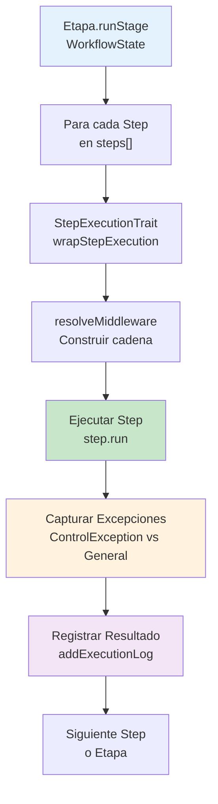
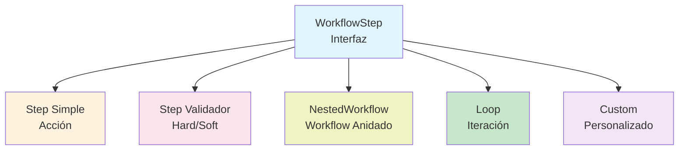
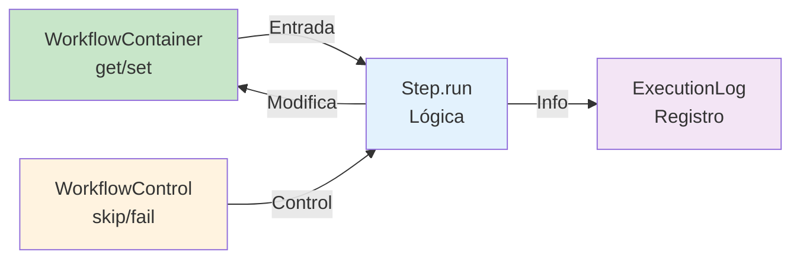
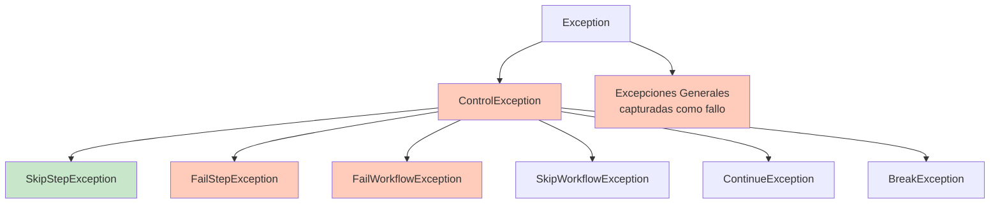
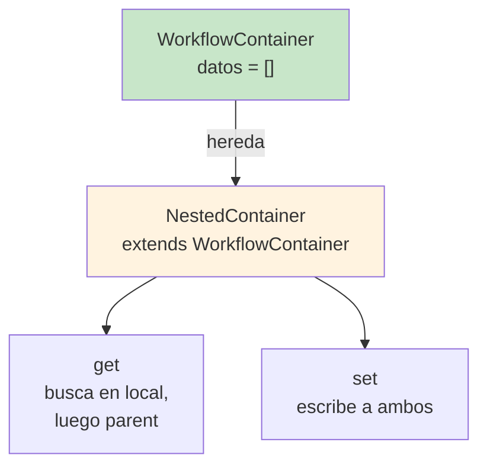

## 1. Objetivo

Este documento proporciona un análisis técnico exhaustivo sobre **cómo se crean, definen y ejecutan los pasos (Steps) de un Workflow** en la librería php-workflow. El análisis se enfoca en la implementación real, describiendo el ciclo completo de vida de un paso desde su definición hasta su ejecución, así como sus mecanismos de control, validación y manejo de errores.

El propósito es comprender la arquitectura de Steps, sus requisitos técnicos, las formas de crear diferentes tipos de steps, cómo reciben y procesan datos, y cómo se integran dentro del flujo de ejecución de un workflow.

---

## 2. Contexto Técnico

### Relación entre Steps y Workflows

Un **Workflow** es un coordinador que orquesta la ejecución de **Steps** en etapas predefinidas. La relación es jerárquica:

```
Workflow (ejecutor)
  └── Etapa 1: Prepare
       ├── Step 1.1
       ├── Step 1.2
       └── Step 1.n
  └── Etapa 2: Validate
       ├── Validador 1
       ├── Validador 2 (hard)
       └── Validador n
  └── Etapa 3: Before
       └── Step 3.1
  └── Etapa 4: Process
       ├── Step 4.1
       ├── Step 4.2 (Loop)
       │   └── Pasos internos del loop
       └── NestedWorkflow (es también un Step)
  └── Etapas 5-7: OnSuccess/OnError/After
```

### Motor de Ejecución (Engine)

El **motor de ejecución** es el `WorkflowState`, que:
- Mantiene el estado global durante la ejecución
- Coordina pasos a través de `Stage::runStage()` y `StepExecutionTrait::wrapStepExecution()`
- Proporciona contexto compartido mediante `WorkflowContainer`
- Captura información de ejecución en `ExecutionLog`

### Arquitectura General

Los Steps se ejecutan siempre siguiendo este flujo:

```
Stage::runStage(WorkflowState)
  ├─ setStage()
  ├─> Para cada Step:
  │    └── StepExecutionTrait::wrapStepExecution(Step, WorkflowState)
  │        ├─> resolveMiddleware()
  │        │   └─> Ejecutar Step::run(WorkflowControl, WorkflowContainer)
  │        └─> Capturar resultado/excepciones
  │            └─> addExecutionLog()
  └─ Devolver siguiente etapa
```

---

## 3. ¿Qué es un Step en Este Proyecto?

### Definición Conceptual

Un **Step** es una **unidad de trabajo desacoplada, reutilizable y autónoma** que implementa una pieza específica de lógica de negocio dentro de un workflow. Es un bloque constructivo fundamental que:

1. **Implementa la interfaz `WorkflowStep`**, proporcionando un contrato estándar
2. **Encapsula lógica independiente** sin dependencias directas del workflow
3. **Recibe datos a través de `WorkflowContainer`** (inyección por contexto)
4. **Comunica cambios de flujo mediante `WorkflowControl`** (skip, fail, continue)
5. **Es invocado por el motor de ejecución** en un momento y contexto definidos
6. **Registra su actividad mediante `ExecutionLog`** para trazabilidad

### Rol y Responsabilidades

- **Rol primario**: Ejecutar una acción atómica o una validación
- **Responsabilidades**:
  - Leer datos del contexto (`$container->get()`)
  - Procesarlos según su lógica
  - Escribir resultados al contexto (`$container->set()`)
  - Comunicar control de flujo (`$control->skipStep()`, `$control->failStep()`)
  - Información para debugging (`$control->attachStepInfo()`)
  - No debe manejar excepciones de forma silenciosa (debe propagarlas o fallar explícitamente)

### Ciclo de Vida de un Step

```
1. Definición
   └─ Crear clase que implementa WorkflowStep
   └─ Implementar getDescription() y run()

2. Inyección
   └─ Registrar en una etapa: ->prepare($step), ->validate($step), ->process($step)

3. Enlace
   └─ Se asocia al Stage correspondiente

4. Ejecución (al llamar executeWorkflow())
   └─ StepExecutionTrait::wrapStepExecution() lo ejecuta
   └─ Su método run() es invocado
   └─ Captura excepciones y registra resultado

5. Finalización
   └─ Se registra en ExecutionLog
   └─ Se pasa al siguiente Step o etapa
```

---

## 4. Proceso para Crear un Step

### Dónde se Define

Un Step se define tipicamente en:

- **Clase propia dedicada**: Ideal para Steps complejos o reutilizables
- **Clase anónima**: Para tests o Steps simples y únicos
- **Factory o Service**: En aplicaciones reales, para centralizar definiciones

### Archivos y Clases Necesarios

#### Archivo 1: La clase del Step

**Ubicación**: `src/<NombrioDelStep>.php` (en la aplicación consumidora)  
**Clase base**: Implementa `PHPWorkflow\Step\WorkflowStep`

```php
<?php

namespace App\Workflow\Step;

use PHPWorkflow\Step\WorkflowStep;
use PHPWorkflow\WorkflowControl;
use PHPWorkflow\State\WorkflowContainer;

class MiPrimerStep implements WorkflowStep
{
    private string $descripcion;
    
    public function __construct(string $descripcion)
    {
        $this->descripcion = $descripcion;
    }

    public function getDescription(): string
    {
        return $this->descripcion;
    }

    public function run(WorkflowControl $control, WorkflowContainer $container): void
    {
        // Lógica del step aquí
    }
}
```

#### Otros archivos necesarios

La librería proporciona clases base que los Steps pueden necesitar:

- `src/Step/WorkflowStep.php` (interfaz a implementar)
- `src/WorkflowControl.php` (para control de flujo)
- `src/State/WorkflowContainer.php` (para acceso a datos)
- `src/State/ExecutionLog/Describable.php` (interfaz para descripciones)

### Registro/Configuración en el Workflow

Un Step **se inyecta directamente** durante la definición del workflow:

```php
$workflow = (new Workflow('MiProceso'))
    ->prepare(new MiPrimerStep('Describir preparativo'))
    ->validate(new ValidadorStep('Validar datos'))
    ->process(new ProcessStep('Procesar'))
    ->executeWorkflow();
```

No hay archivo de configuración separado ni "registro" explícito. El Step se registra por: **inyección instantánea en la llamada al método de la etapa**.

### Integración con el Workflow

Cuando se llama `->prepare($step)`:

1. Se crea una instancia de `Prepare` (si no existe)
2. Se añade el paso al array `$steps[]` de esa etapa
3. Se devuelve la etapa para encadenamiento
4. Durante `executeWorkflow()`, se itera sobre `$steps` y se ejecuta cada uno

### Dependencias Requeridas

Un Step **debe tener acceso a** (proporcionado automáticamente por el framework):

1. **WorkflowControl** (`$control`): Para comunicar cambios de flujo
2. **WorkflowContainer** (`$container`): Para acceder a datos compartidos
3. **WorkflowState** (implícito): Disponible via `WorkflowState::getRunningWorkflow()`
4. **Ninguna otra dependencia del framework** (no es inyectable directamente)

---

## 5. Requisitos de un Step

### Interfaces y Contratos

Un Step **debe obligatoriamente implementar `WorkflowStep`**:

```php
interface WorkflowStep extends Describable
{
    public function run(WorkflowControl $control, WorkflowContainer $container): void;
}
```

Como hereda de `Describable`, también debe implementar:

```php
interface Describable
{
    public function getDescription(): string;
}
```

### Métodos Requeridos

| Método | Firma | Responsabilidad | Requisitos |
|--------|-------|-----------------|-----------|
| `run()` | `run(WorkflowControl $control, WorkflowContainer $container): void` | Ejecuta la lógica del paso | Puede lanzar excepciones, acceder a `$control`, acceder a `$container` |
| `getDescription()` | `getDescription(): string` | Devuelve descripción legible | Debe devolver string no vacío |

### Parámetros Mínimos

Un Step **debe recibir** (siempre, en toda invocación):

1. **`WorkflowControl $control`**: Objeto que proporciona métodos para controlar flujo
   - `skipStep()`, `failStep()`, `failWorkflow()`, `skipWorkflow()`
   - `continue()`, `break()` (en loops)
   - `attachStepInfo()`, `warning()`

2. **`WorkflowContainer $container`**: Objeto que proporciona acceso a datos compartidos
   - `get(key)`: Obtiene un valor
   - `set(key, value)`: Establece un valor
   - `has(key)`: Verifica existencia
   - `unset(key)`: Elimina un valor

### Estructura Esperada

Un Step debe:

1. Estar **totalmente stateless** (no almacenar estado entre ejecuciones)
2. Ser **idempotente cuando sea posible** (ej: validaciones, lecturas)
3. Ser **desacoplado del workflow** (no acceder a `$workflowState` directamente)
4. Comunicar cambios mediante **excepciones explícitas** o **WorkflowControl**
5. No atrapar silenciosamente excepciones no controladas

### Validaciones Necesarias

El framework valida automáticamente:

- Que el Step implemente `WorkflowStep` (en tiempo de inyección o ejecución)
- Que `getDescription()` devuelva un string
- Que `run()` se ejecute sin errores fatales (errores se propagan excepto predefinidas)

El Step **es responsable de validar**:

- Que los datos requeridos existan en `$container`
- Que los datos sean del tipo correcto
- Que las precondiciones se cumplan

---

## 6. Información y Datos que Maneja

### Entradas al Step

Un Step recibe información a través de dos canales:

#### Canal 1: WorkflowContainer (Datos Compartidos)

```php
public function run(WorkflowControl $control, WorkflowContainer $container): void
{
    $usuario = $container->get('usuario');              // Lectura
    $producto = $container->get('producto');            // Lectura
    $cantidad = $container->get('cantidad') ?? 1;       // Con default
}
```

**Características**:
- Array asociativo accesible por clave (string)
- Compartido entre **todos los Steps del workflow actual**
- Persistente durante toda la ejecución del workflow
- Se pasa como parámetro a `executeWorkflow()`

#### Canal 2: Parámetros al Constructor

Si el Step necesita configuración, se pasa en el constructor:

```php
class ValidarStockStep implements WorkflowStep
{
    private int $minimoStock;
    
    public function __construct(int $minimoStock = 10)
    {
        $this->minimoStock = $minimoStock;
    }
    
    public function run(WorkflowControl $control, WorkflowContainer $container): void
    {
        $stock = $container->get('stock');
        if ($stock < $this->minimoStock) {
            $control->failStep('Stock insuficiente');
        }
    }
}
```

### Salidas del Step

Un Step produce información a través de múltiples canales:

#### Canal 1: Modificar WorkflowContainer

```php
public function run(WorkflowControl $control, WorkflowContainer $container): void
{
    $resultado = procesar($container->get('datos'));
    $container->set('resultado_procesado', $resultado);
    $container->set('timestamp', time());
}
```

**Características**:
- Los cambios son **persistentes** para Steps posteriores
- Debe haber acuerdo implícito sobre las claves usadas
- Accesible tras ejecución via `$result->getContainer()->get(key)`

#### Canal 2: Información de Debug (StepInfo)

```php
public function run(WorkflowControl $control, WorkflowContainer $container): void
{
    $control->attachStepInfo('Procesó 5 elementos');
    $control->attachStepInfo('Tiempo: 234ms');
    $control->attachStepInfo('Resultado crítico', ['valor' => $valor]);
}
```

**Características**:
- Se registra en `ExecutionLog`
- Aparece en `$result->debug()`
- Proporciona trazabilidad sin afectar resultado

#### Canal 3: Advertencias (Warnings)

```php
public function run(WorkflowControl $control, WorkflowContainer $container): void
{
    try {
        procesarConError();
    } catch (Exception $e) {
        $control->warning('Procesamiento incompleto', $e);
    }
}
```

**Características**:
- No detiene el workflow
- Se acumula en `ExecutionLog->warnings`
- Accesible via `$result->getWarnings()`

#### Canal 4: Control de Flujo (Excepciones)

```php
public function run(WorkflowControl $control, WorkflowContainer $container): void
{
    if (!validar()) {
        $control->failStep('Validación fallida');  // Lanza FailStepException
    }
    
    if (noEsNecesario()) {
        $control->skipStep('No aplicable');         // Lanza SkipStepException
    }
}
```

**Características**:
- Producen **excepciones controladas** que cambian flujo
- Se capturan en `wrapStepExecution()`
- Registran el estado final del Step

### Contexto Compartido

El `WorkflowContainer` es compartido entre:

- **Todos los Steps** de la ejecución actual
- **No se comparte** entre ejecuciones diferentes del mismo workflow
- **En workflows anidados**, se crea un `NestedContainer` que hereda del parent

### Estado Interno del Step

Un Step **no debe almacenar estado entre invocaciones**. El patrón correcto es:

```php
// INCORRECTO - almacena estado
class ContadorStep implements WorkflowStep
{
    private int $contador = 0;
    public function run(...) { $this->contador++; }
}

// CORRECTO - usa container
class ContadorStep implements WorkflowStep
{
    public function run(WorkflowControl $control, WorkflowContainer $container): void
    {
        $contador = ($container->get('contador') ?? 0) + 1;
        $container->set('contador', $contador);
    }
}
```

### Persistencia

Un Step **no persiste datos automáticamente**. La persistencia debe hacerla explícitamente:

```php
public function run(WorkflowControl $control, WorkflowContainer $container): void
{
    $usuario = $container->get('usuario');
    
    // Hacer cambios
    $usuario->nombre = 'Nuevo Nombre';
    
    // Persistir manualmente
    $this->usuarioRepository->save($usuario);
    
    // Actualizar container
    $container->set('usuario_actualizado', $usuario);
}
```

### Parámetros de Configuración Interna

Un Step puede tener parámetros en su constructor:

```php
$step = new SendEmailStep(
    $mailer,
    $template = 'welcome.html',
    $retries = 3
);

$workflow->process($step);
```

Estos parámetros **no vienen del container**, sino del contexto de creación.

---

## 7. Tipos de Steps Detectados

Basado en el análisis del código, existen los siguientes tipos de Steps:

### Tipo 1: Step Simple (Acción)

**Características**:
- Implementa `WorkflowStep`
- Ejecuta una acción única
- Puede verificar precondiciones
- Genera cambios en el container

**Ejemplo de uso real**:
```php
class AddItemToCartStep implements WorkflowStep
{
    public function getDescription(): string { return "Add item to cart"; }
    public function run(WorkflowControl $control, WorkflowContainer $container): void
    {
        $cart = $container->get('cart');
        $item = $container->get('item');
        $cart->addItem($item);
        $container->set('cart', $cart);
    }
}
```

**Ubicación en workflow**:
- `->prepare()`, `->before()`, `->process()`, `->onSuccess()`, `->onError()`, `->after()`

**Etapa típica**: **Process** (principal)

---

### Tipo 2: Step Validador (Decisión/Validación)

**Características**:
- Implementa `WorkflowStep`
- Verifica condiciones
- Puede ser "hard" (detiene todo) o "soft" (registra advertencia)
- No modifica datos fundamentalmente

**Ejemplo de uso real**:
```php
class UserPermissionValidator implements WorkflowStep
{
    public function getDescription(): string { return "Check user permissions"; }
    public function run(WorkflowControl $control, WorkflowContainer $container): void
    {
        $user = $container->get('user');
        $resource = $container->get('resource');
        
        if (!$user->canAccess($resource)) {
            $control->failStep('User lacks permission');
        }
    }
}
```

**Ubicación en workflow**:
- `->validate($validator, $isHard)` (solo en etapa Validate)

**Etapa típica**: **Validate**

**Variantes**:
- **Hard validator** (`->validate($v, true)`): Falla inmediatamente
- **Soft validator** (`->validate($v, false)`): Se recopila como advertencia

---

### Tipo 3: Step Anidado (NestedWorkflow)

**Caracterización**: 
- Implementa `WorkflowStep`
- Contiene un workflow completo dentro
- Es una clase predefinida: `PHPWorkflow\Step\NestedWorkflow`

**Cómo se crea**:
```php
$nestedStep = new NestedWorkflow(
    (new Workflow('SubTarea'))->prepare(...)->process(...),
    $contentContainer = null
);

$workflow->process($nestedStep);
```

**Características especiales**:
- Ejecuta un workflow independiente dentro del Step
- Crea un `NestedContainer` que hereda datos del parent
- Si el workflow anidado falla, falla el Step
- Accesible via `$nestedStep->getNestedWorkflowResult()`

**Ubicación en workflow**:
- Puede estar en cualquier etapa (es un Step normal)

---

### Tipo 4: Step Loop (Bucle/Iteración)

**Caracterización**:
- Implementa `WorkflowStep`
- Contiene múltiples Steps internos
- Es una clase predefinida: `PHPWorkflow\Step\Loop`
- Controla iteración via interfaz `LoopControl`

**Cómo se crea**:
```php
$loop = new Loop(
    $loopControl = new MiLoopControl(),
    $continueOnError = false
);

$loop->addStep($paso1);
$loop->addStep($paso2);

$workflow->process($loop);
```

**Interfaz LoopControl**:
```php
interface LoopControl extends Describable
{
    public function executeNextIteration(
        int $iteration,
        WorkflowControl $control,
        WorkflowContainer $container
    ): bool;  // true: continuar iteration, false: break loop
}
```

**Características especiales**:
- Itera mientras `executeNextIteration()` retorna true
- Cada iteración ejecuta todos los Steps internos
- Soporta `$control->continue()` (salta al siguiente Step)
- Soporta `$control->break()` (termina el loop)
- Opción `continueOnError` para fallos no fatales

**Ubicación en workflow**:
- Típicamente en `->process()`
- Puede estar en cualquier etapa

---

### Tipo 5: Step Personalizado (Subclase)

Cualquier clase que implemente `WorkflowStep` es un Step válido. Ejemplos teóricos:

```php
class TransaccionalStep implements WorkflowStep { /* persiste datos */ }
class AsincronoStep implements WorkflowStep { /* queue async */ }
class CondicionalStep implements WorkflowStep { /* lógica if-else */ }
class AgregarStep implements WorkflowStep { /* combina múltiples acciones */ }
```

El framework **no restringe tipos** más allá del contrato `WorkflowStep`.

---

## 8. Cómo se dan Instrucciones al Step

### Vía 1: Constructor (Configuración Estática)

```php
$step = new ProcessStep(
    priority: 5,
    timeout: 60,
    retryCount: 3
);

$workflow->process($step);
```

**Características**:
- Configuración inmutable para la ejecución
- Se establece **antes de inyectar** el step
- Valores almacenados en la instancia del Step

---

### Vía 2: WorkflowContainer (Datos Dinámicos)

```php
$container = (new WorkflowContainer())
    ->set('usuario', $usuario)
    ->set('producto', $producto)
    ->set('cantidad', 5);

$result = $workflow->executeWorkflow($container);
```

**Características**:
- Datos variables para cada ejecución
- El Step los **lee desde el container**
- El Step puede **modificarlos durante ejecución**

---

### Vía 3: WorkflowControl (Cambios de Flujo)

```php
public function run(WorkflowControl $control, WorkflowContainer $container): void
{
    $control->skipStep('No aplicable');
    $control->failStep('Precondición no cumplida');
    $control->skipWorkflow('Abortar proceso');
    $control->continue('Saltar este paso (en loop)');
    $control->break('Terminar loop');
}
```

**Características**:
- **Comandos ejecutables** que modifican el flujo
- Se lanza **excepciones específicas** que el framework captura
- El framework maneja el cambio de estado

---

### Vía 4: Middleware (Procesamiento Transversal)

El framework aplica automáticamente middleware:

```php
$workflow = new Workflow('Tarea', 
    new ProfileStep(),        // Middleware 1: mide tiempo
    new DependencyCheck()     // Middleware 2: valida dependencias
);
```

**Características**:
- Middleware se aplica **a cada Step**
- En PHP >= 8, se añade `WorkflowStepDependencyCheck()` automáticamente
- Middleware pueden interceptar/modificar ejecución

---

### Vía 5: Inyección de Dependencias (Dentro del Constructor)

```php
class SendEmailStep implements WorkflowStep
{
    private EmailService $emailService;
    
    public function __construct(EmailService $emailService, string $template)
    {
        $this->emailService = $emailService;
        $this->template = $template;
    }
}

// Inyección manual
$step = new SendEmailStep($emailService, 'welcome.html');
$workflow->process($step);
```

**Características**:
- No es automática (no hay container de DI)
- El Step es responsable de sus dependencias
- Típicamente manejado por la aplicación consumidora

---

## 9. Ejecución del Step

### Ciclo de Ejecución Completo

```
Stage::runStage(WorkflowState)
  ├─ workflowState.setStage(STAGE_TYPE)
  ├─ Para cada Step en steps[]:
  │   ├─ workflowState.setStep(step)
  │   └─ StepExecutionTrait::wrapStepExecution(step, workflowState)
  │       ├─ resolveMiddleware(step, workflowState)
  │       │   ├─ tip = () => step.run(control, container)
  │       │   └─ Envolver en middleware
  │       │       └─ Ejecutar tip() (step.run())
  │       ├─ Capturar excepciones:
  │       │   ├─ SkipStepException / FailStepException
  │       │   ├─ Excepciones generales (Exception)
  │       │   └─ SkipWorkflowException / FailWorkflowException
  │       ├─ Registrar resultado:
  │       │   ├─ addExecutionLog(step, STATE_*, reason)
  │       │   └─ Agregar a ExecutionLog
  │       └─ Retornar (continuar con siguiente step)
  └─ Retornar siguiente etapa
```

### Métodos Invocados (Orden Exacto)

1. **Inicial**:
   - `Stage.runStage(WorkflowState)`
   - `workflowState.setStage(stage_constant)`

2. **Para cada Step**:
   - `workflowState.setStep(step)`
   - `StepExecutionTrait.wrapStepExecution(step, workflowState)`

3. **Dentro de wrapStepExecution**:
   - `resolveMiddleware(step, workflowState)` → retorna callable
     - En PHP >= 8: añade `WorkflowStepDependencyCheck` al inicio
     - Itera sobre middlewares
     - Construye cadena: tip = () => middleware(...) { tip(...) }
   - try-catch:
     - `tip()` → ejecuta **step.run(control, container)**
     - Excepciones se capturan y procesan

4. **Captura de Resultado**:
   - Éxito: `workflowState.addExecutionLog(step)` (sin reason)
   - Skip: `addExecutionLog(step, STATE_SKIPPED, reason)`
   - Fail: `addExecutionLog(step, STATE_FAILED, reason)`

5. **Post-Ejecución**:
   - Si en Prepare/Validate/Before + fail → relanza excepción
   - Si en Process+ + fail → solo registra warning
   - Si Loop + control exception → relanza para manejo especial

### Orquestación: ¿Quién Llama a Quién?

```
Workflow.runStage(workflowState)
  ├─ nextStage = this.nextStage  (primera etapa: Prepare/Validate/etc)
  ├─ while (nextStage != null):
  │   ├─ nextStage = nextStage.runStage(workflowState)
  │   │   ├─ (Stage.runStage o MultiStepStage.runStage)
  │   │   ├─ Para cada step:
  │   │   │   ├─ this.wrapStepExecution(step, workflowState)
  │   │   │   └─ Captura excepciones
  │   │   ├─ return this.nextStage  (siguiente etapa)
  │   └─ (loop continúa con siguiente etapa)
  └─ null = fin (no hay más etapas)
```

---

## 10. Validación y Control de Errores

### Validaciones Automáticas del Framework

El framework valida automáticamente que:

1. **El Step implemente `WorkflowStep`**: Si no, error en tiempo de ejecución
2. **`getDescription()` devuelva string**: Si devuelve null/otro tipo, excepción
3. **`run()` sea invocable**: Si no existe método, fatal error
4. **Dependencias de etapa**: En PHP >= 8, `WorkflowStepDependencyCheck` valida automáticamente

### Manejo de Excepciones por Tipo

#### Excepciones de Control (Predefinidas)

Son **capturadas y procesadas** por el framework:

| Excepción | Origen | Efecto |
|-----------|--------|--------|
| `SkipStepException` | `$control->skipStep()` | Step se marca como SKIPPED, continúa |
| `FailStepException` | `$control->failStep()` | Step se marca como FAILED, puede abortar |
| `FailWorkflowException` | `$control->failWorkflow()` | Aborta todo el workflow |
| `SkipWorkflowException` | `$control->skipWorkflow()` | Salta el resto del workflow |
| `ContinueException` | `$control->continue()` | En loop: siguiente iteración. Fuera: skipStep |
| `BreakException` | `$control->break()` | En loop: termina loop. Fuera: skipStep |

**Todas son subclases de `ControlException`** y se capturan en `wrapStepExecution()`.

#### Excepciones Generales (No Controladas)

**Todas las otras excepciones** son tratadas como errores:

```php
try {
    $step->run($control, $container);
} catch (SkipStepException | FailStepException $exception) {
    // Capturada y procesada
} catch (Exception $exception) {
    // Tratada como excepción general
    addExecutionLog(step, STATE_FAILED, $exception->getMessage());
}
```

**Comportamiento según etapa**:

- **Prepare, Validate, Before**: Se relanza la excepción (aborta workflow)
- **Process**: Se captura, se registra, continúa (no aborta)
- **OnSuccess/OnError/After**: Se captura, se registra, continúa

---

### Validación de Dependencias

En PHP >= 8, se añade automáticamente `WorkflowStepDependencyCheck`:

```php
// Dentro de resolveMiddleware()
if (PHP_MAJOR_VERSION >= 8) {
    array_unshift($middlewares, new WorkflowStepDependencyCheck());
}
```

**Responsabilidad**: 
- Valida que `WorkflowStep::Dependency\*` se cumplan
- Verifica precondiciones antes de ejecutar

---

### Rollback (No Automático)

No existe rollback automático integrado en el framework. Los Steps son responsables:

```php
public function run(WorkflowControl $control, WorkflowContainer $container): void
{
    try {
        $db->insert('usuarioIntento', $usuario);
        $api->reservar($reserva);
    } catch (Exception $e) {
        // Rollback manual
        $db->delete('usuarioIntento', $usuario->id);
        $control->failStep("No se pudo reservar: " . $e->getMessage());
    }
}
```

---

### Logging Integrado

Cada Step se registra automáticamente en `ExecutionLog`:

```php
workflowState.addExecutionLog(step, STATE, reason)
```

Donde:
- `STATE` = 'ok' | 'skipped' | 'failed'
- `reason` = mensaje de excepción (si aplica)

**Acceso al log**:
```php
$result = $workflow->executeWorkflow();
echo $result->debug();  // Imprime log completo
```

---

## 11. Control de Éxito/Finalización

### ¿Cómo se Determina el Éxito de un Step?

Un Step es exitoso si:

1. **Método `run()` completa SIN lanzar excepciones** → STATE_SUCCESS ('ok')
2. **Se registra**: `addExecutionLog(step)` sin reason

```php
public function run(WorkflowControl $control, WorkflowContainer $container): void
{
    // Lógica que completa sin excepciones
    $data = procesar($container->get('datos'));
    $container->set('resultado', $data);
    // Fin implícito → éxito
}
```

### Determinación de Fallo

Un Step falla si:

1. **`$control->failStep()` es invocado** → FailStepException
2. **Excepción general es lanzada** → capturada como STATE_FAILED
3. **Se registra**: `addExecutionLog(step, STATE_FAILED, reason)`

```php
public function run(WorkflowControl $control, WorkflowContainer $container): void
{
    if (!validar()) {
        $control->failStep('Validación fallida');  // → FailStepException
        return;  // Innecesario, la excepción se lanza
    }
    
    throw new ValidationException('Error');        // → Exception capturada
}
```

### Conducta Según Etapa

**En Prepare, Validate, Before**:
- Si un Step falla → **Workflow se aborta**
- La excepción se relanza
- Etapas posteriores (OnSuccess/OnError/After) se omiten

**En Process**:
- Si un Step falla → **Se captura, se registra, continúa**
- La excepción se almacena en `workflowState.processException`
- Etapas OnSuccess/OnError evalúan esta excepción

**En OnSuccess/OnError/After**:
- Si un Step falla → **Se registra como warning, no aborta**
- El workflow se considera "finalizado"

### Transición al Siguiente Step

Después de ejecutar un Step:

1. Se registra en `ExecutionLog`
2. Se pasa al **siguiente Step en la misma etapa**
3. Si no hay más Steps → se pasa a la **siguiente etapa**
4. Las etapas se encadenan automáticamente via `nextStage`

```
Step 1 ok → Step 2 → Step n → Siguiente etapa → ...
```

---

## 12. Entradas/Salidas (E/S)

### Parámetros de Entrada

Un Step recibe información mediante:

#### Entrada 1: Constructor (Configuración)

```php
class MyStep implements WorkflowStep
{
    public function __construct(private int $priority, private string $template)
    {}
}

// Uso
$step = new MyStep(priority: 10, template: 'email.html');
```

**Características**:
- Establecida **antes de inyectar el step**
- Inmutable durante ejecución
- Almacenada en propiedades de la instancia

#### Entrada 2: WorkflowContainer (Runtime)

```php
public function run(WorkflowControl $control, WorkflowContainer $container): void
{
    $usuario = $container->get('usuario');
    $producto = $container->get('producto');
    $cantidad = $container->get('cantidad') ?? 1;
}
```

**Características**:
- Datos compartidos, variables por ejecución
- Disponible via `get(key)`
- Puede ser null (usar ?? o has())

#### Entrada 3: WorkflowState (Referencias)

```php
public function run(WorkflowControl $control, WorkflowContainer $container): void
{
    $state = WorkflowState::getRunningWorkflow();
    $stage = $state->getStage();        // STAGE_PROCESS, etc
    $name = $state->getWorkflowName();  // 'MiWorkflow'
}
```

**Características**:
- No es parámetro oficial, pero accesible
- Proporciona contexto de ejecución
- Estado global compartido

### Parámetros de Salida

Un Step produce información mediante:

#### Salida 1: Modificar WorkflowContainer

```php
public function run(WorkflowControl $control, WorkflowContainer $container): void
{
    $resultado = procesar($container->get('datos'));
    $container->set('resultado_procesado', $resultado);
    $container->set('timestamp', time());
}
```

**Acceso posterior**:
```php
$result = $workflow->executeWorkflow();
echo $result->getContainer()->get('resultado_procesado');
```

#### Salida 2: StepInfo (Debug)

```php
public function run(WorkflowControl $control, WorkflowContainer $container): void
{
    $control->attachStepInfo('Se procesaron 5 items');
    $control->attachStepInfo('Tiempo: 234ms');
    $control->attachStepInfo('Stats', ['count' => 5, 'time' => 234]);
}
```

**Acceso posterior**:
```
Process log for workflow 'MiTarea':
Process:
  - MyStep: ok
    - Se procesaron 5 items
    - Tiempo: 234ms
    - Stats
```

#### Salida 3: Warnings (Alertas No Fatales)

```php
public function run(WorkflowControl $control, WorkflowContainer $container): void
{
    try {
        apiCall();
    } catch (Exception $e) {
        $control->warning('API indisponible, usando cache', $e);
    }
}
```

**Acceso posterior**:
```php
if ($result->hasWarnings()) {
    $warnings = $result->getWarnings();
}
```

### Transformación de Datos

Un Step típicamente:

1. **Lee** datos del container
2. **Transforma** usando lógica
3. **Escribe** resultados al container

```php
public function run(WorkflowControl $control, WorkflowContainer $container): void
{
    // Lectura
    $usuario = $container->get('usuario');
    $cantidad = $container->get('cantidad');
    
    // Transformación
    $precioTotal = $usuario->aplicarDescuento($cantidad);
    
    // Escritura
    $container->set('precio_total', $precioTotal);
}
```

### Persistencia de Datos

El container **persiste durante el workflow**. Para persistir en BD:

```php
public function run(WorkflowControl $control, WorkflowContainer $container): void
{
    $usuario = $container->get('usuario_a_guardar');
    
    // Persistencia manual
    $repository->save($usuario);
    
    // Actualizar container para steps posteriores
    $usuario->id = $usuario->generateId();
    $container->set('usuario_guardado', $usuario);
}
```

---

## 13. Archivos Involucrados y Función

### Grupo 1: Interfaces y Contratos

#### `src/Step/WorkflowStep.php`

- **Tipo**: Interfaz
- **Responsabilidad**: Define el contrato obligatorio para Steps
- **Métodos**: `run(WorkflowControl, WorkflowContainer): void` y `getDescription(): string`
- **Depende de**: `Describable.php`, `WorkflowControl.php`, `WorkflowContainer.php`
- **Es usado por**: Todas las etapas que ejecutan Steps, tests, aplicaciones
- **Por qué existe**: Proporciona un contrato estándar que todos los Steps deben cumplir

---

### Grupo 2: Ejecución de Steps

#### `src/Step/StepExecutionTrait.php`

- **Tipo**: Trait
- **Responsabilidad**: Implementa la lógica de ejecución de Steps con captura de excepciones
- **Método principal**: `wrapStepExecution(WorkflowStep $step, WorkflowState $state)`
- **Método auxiliar**: `resolveMiddleware(WorkflowStep $step, WorkflowState $state)`
- **Depende de**: `WorkflowStep.php`, `WorkflowState.php`, `Middleware classes`
- **Es usado por**: `Stage.php` (base de etapas)
- **Por qué existe**: Centraliza la lógica de ejecución y captura de excepciones para todas las etapas

**Comportamiento específico**:
- Construye cadena de middleware dinámicamente
- Captura excepciones de control y las procesa
- Propaga o registra excepciones generales según etapa
- Registra resultado en ExecutionLog

---

### Grupo 3: Tipos de Steps Especiales

#### `src/Step/NestedWorkflow.php`

- **Tipo**: Clase que implementa `WorkflowStep`
- **Responsabilidad**: Permite ejecutar un workflow completo como un Step
- **Constructor**: `__construct(ExecutableWorkflow $nestedWorkflow, ?WorkflowContainer $container)`
- **Método especial**: `getNestedWorkflowResult(): WorkflowResult`
- **Depende de**: `WorkflowStep.php`, `ExecutableWorkflow.php`, `NestedContainer.php`
- **Es usado por**: Workflows que necesitan composición de workflows
- **Por qué existe**: Proporciona composición jerárquica de workflows

**Comportamiento especial**:
- Crea `NestedContainer` para herencia de datos
- Si el workflow anidado falla, falla el Step
- Proporciona acceso al resultado del workflow anidado

#### `src/Step/Loop.php`

- **Tipo**: Clase que implementa `WorkflowStep` y usa `StepExecutionTrait`
- **Responsabilidad**: Implementa bucles iterativos controlados
- **Constructor**: `__construct(LoopControl $loopControl, bool $continueOnError = false)`
- **Método**: `addStep(WorkflowStep $step): self`
- **Depende de**: `WorkflowStep.php`, `LoopControl.php`, `StepExecutionTrait.php`
- **Es usado por**: Workflows que necesitan iteración
- **Por qué existe**: Proporciona iteración controlada dentro de workflows

**Comportamiento especial**:
- Mantiene estado de iteración
- Ejecuta Steps internos en cada iteración
- Maneja `continue()` y `break()` específicamente
- Soporta fallo continuo con `continueOnError`

---

### Grupo 4: Control de Loops

#### `src/Step/LoopControl.php`

- **Tipo**: Interfaz
- **Responsabilidad**: Define cómo se determina si continúa o termina un loop
- **Método**: `executeNextIteration(int $iteration, WorkflowControl, WorkflowContainer): bool`
- **Depende de**: `Describable.php`
- **Es usado por**: `Loop.php`
- **Por qué existe**: Proporciona abstracción para lógica de control del loop

---

### Grupo 5: Control de Flujo desde Steps

#### `src/WorkflowControl.php`

- **Tipo**: Clase de control
- **Responsabilidad**: Proporciona métodos para Steps para controlar el flujo
- **Métodos principales**:
  - `skipStep(reason)`, `failStep(reason)`, `failWorkflow(reason)`, `skipWorkflow(reason)`
  - `continue(reason)`, `break(reason)`
  - `attachStepInfo(info, context)`, `warning(message, exception)`
- **Depende de**: Excepciones de control (`SkipStepException`, etc.)
- **Es usado por**: Steps en su método `run()`
- **Por qué existe**: Proporciona interfaz limpia para control de flujo desde Steps

**Como funciona internamente**:
- Cada método lanza una excepción específica
- Las excepciones se capturan en `wrapStepExecution()`
- El framework interpreta la excepción y actúa en consecuencia

---

### Grupo 6: Excepciones de Control

#### `src/Exception/WorkflowControl/*.php`

- **Tipos**: `SkipStepException`, `FailStepException`, `FailWorkflowException`, `SkipWorkflowException`, `ContinueException`, `BreakException`
- **Clase base**: `ControlException`
- **Responsabilidad**: Comunican cambios de flujo desde Steps al framework
- **Por qué existen**: Permiten saltos no-locales y cambios de control desde dentro de Steps

---

### Grupo 7: Almacenamiento y Contexto

#### `src/State/WorkflowContainer.php`

- **Tipo**: Clase contenedor
- **Responsabilidad**: Almacena datos compartidos entre Steps
- **Métodos**: `get(key)`, `set(key, value)`, `has(key)`, `unset(key)`
- **Depende de**: Ninguna
- **Es usado por**: Todos los Steps vía parámetro en `run()`
- **Por qué existe**: Proporciona mecanismo de compartición de contexto sin acoplamiento

#### `src/State/NestedContainer.php`

- **Tipo**: Clase que extiende `WorkflowContainer`
- **Responsabilidad**: Contenedor especial para workflows anidados
- **Características**: Busca en container local, luego en parent
- **Depende de**: `WorkflowContainer.php`
- **Es usado por**: `NestedWorkflow.php`
- **Por qué existe**: Permite herencia de variables en workflows anidados

---

### Grupo 8: Estadísticas y Logging

#### `src/State/ExecutionLog/ExecutionLog.php`

- **Tipo**: Clase de registro
- **Responsabilidad**: Registra ejecución de cada Step
- **Métodos principales**: `addStep()`, `attachStepInfo()`, `addWarning()`
- **Constantes**: `STATE_SUCCESS`, `STATE_SKIPPED`, `STATE_FAILED`
- **Es usado por**: `StepExecutionTrait.php`
- **Por qué existe**: Proporciona trazabilidad completa para debugging

---

### Grupo 9: Información de Steps

#### `src/State/ExecutionLog/Describable.php`

- **Tipo**: Interfaz
- **Responsabilidad**: Define método `getDescription()` para descripciones en logs
- **Es usado por**: `WorkflowStep.php`, `Loop.php`, todos los Steps
- **Por qué existe**: Permite descripciones humanizadas en registros

---

## 14. Estructura Gráfica

### Diagrama 1: Ciclo de Ejecución de un Step



### Diagrama 2: Tipos de Steps



### Diagrama 3: Flujo de Datos en un Step



### Diagrama 4: Arquitectura de Excepciones



### Diagrama 5: Jerarquía de Contenedores



---

## 15. Tabla de Dependencias de Archivos

| Archivo | Tipo | Depende de | Es usado por | Responsabilidad |
|---------|------|-----------|------------|-----------------|
| `WorkflowStep.php` | Interfaz | `Describable.php` | Todos los Steps, Etapas | Define contrato de Steps |
| `StepExecutionTrait.php` | Trait | `WorkflowStep.php`, `WorkflowState.php`, Middleware | `Stage.php` | Ejecuta Steps con captura |
| `NestedWorkflow.php` | Clase | `WorkflowStep.php`, `ExecutableWorkflow.php`, `NestedContainer.php` | Workflows, Tests | Permite workflows anidados |
| `Loop.php` | Clase | `WorkflowStep.php`, `LoopControl.php`, `StepExecutionTrait.php` | Workflows, Tests | Implementa iteración |
| `LoopControl.php` | Interfaz | `Describable.php` | `Loop.php` | Define control de bucle |
| `WorkflowControl.php` | Clase | Excepciones de control | Steps (via parámetro) | Control de flujo desde Steps |
| `Excepciones/WorkflowControl/*.php` | Clases | `ControlException.php` | `WorkflowControl.php`, `StepExecutionTrait.php` | Comunican cambios de flujo |
| `WorkflowContainer.php` | Clase | Ninguna | Steps, Etapas, Tests | Contextualmente compartido |
| `NestedContainer.php` | Clase | `WorkflowContainer.php` | `NestedWorkflow.php` | Herencia de context |
| `ExecutionLog.php` | Clase | `WorkflowStep.php`, `Describable.php` | `WorkflowState.php` | Registra ejecución |
| `Describable.php` | Interfaz | Ninguna | `WorkflowStep.php`, `ExecutionLog.php` | Define descripciones |

---

## 16. Flujo Técnico Completo de Ejecución de un Step

### Secuencia Paso a Paso Detallada

#### **Fase 1: Preparación (Antes de Ejecutar)**

```
1. Usuario crea Step
   $step = new MisaStepImplementation('config')

2. Usuario inyecta en Workflow
   $workflow->process($step)
   
3. Se crea Stage y se asigna Step al array
   $stage->addStep($step)
   → stages[Process] = [step1, step2, ...]

4. Usuario ejecuta workflow
   $result = $workflow->executeWorkflow($container)
```

#### **Fase 2: Inicialización de Ejecución**

```
1. AllowNextExecuteWorkflow::executeWorkflow() es llamado
   
2. Se crea WorkflowState
   $state = new WorkflowState($container)
   $state->setWorkflowName('MiWorkflow')
   $state->setMiddlewares([...])
   
3. Se inicia ExecutionLog
   $state->getExecutionLog()->startExecution()
   
4. Se inicia iteración de etapas
   $this->workflow->runStage($state)
```

#### **Fase 3: Ejecución de Etapa (Process como ejemplo)**

```
1. Process::runStage($state) es invocado
   
2. Se establece etapa actual
   $state->setStage(WorkflowState::STAGE_PROCESS)
   
3. Se inicia try-catch
   try {
       parent::runStage($state)  // → MultiStepStage::runStage()
   } catch (Exception $e) {
       $state->setProcessException($e)
   }
```

#### **Fase 4: Ejecución de Cada Step (MultiStepStage)**

```
1. MultiStepStage::runStage($state) itera
   foreach ($this->steps as $step) {
       $state->setStep($step)
       $this->wrapStepExecution($step, $state)
   }
```

#### **Fase 5: Ejecución del Step (StepExecutionTrait)**

```
1. StepExecutionTrait::wrapStepExecution($step, $state) inicia
   
2. Se construye cadena de middleware
   $tip = fn() => $step->run(
       $state->getWorkflowControl(),
       $state->getWorkflowContainer()
   )
   
   En PHP >= 8:
   middlewares = [
       new WorkflowStepDependencyCheck(),
       // + middlewares del usuario
   ]
   
   Construcción:
   tip = wrappedMiddleware(..., tip )
   tip = wrappedMiddleware2(..., tip)
   
3. Se ejecuta bajo try-catch
   try {
       tip()  // → Ejecuta: step->run(...)
   } catch (SkipStepException | FailStepException $e) {
       // Capturada y procesada
       $state->addExecutionLog($step, STATE_*, $reason)
       return  // No relanza
   } catch (Exception $e) {
       // Capturada
       $state->addExecutionLog($step, STATE_FAILED, $message)
       if ($state.stage <= STAGE_PROCESS) {
           throw $e  // Relanza en etapas tempranas
       }
       return  // No relanza en etapas tardías
   }
```

#### **Fase 6: Dentro del Step (run method)**

```
Ahora en: MyStep::run(WorkflowControl $control, WorkflowContainer $container)

1. Step lee del container
   $data = $container->get('entrada')
   
2. Step ejecuta lógica
   $resultado = procesar($data)
   
3. Step puede:
   a) Registrar información
      $control->attachStepInfo('Procesó 5 items')
   
   b) Modificar container
      $container->set('resultado', $resultado)
   
   c) Registrar advertencia
      $control->warning('Cache miss')
   
   d) Controlar flujo
      if (!valido) { $control->failStep('Inválido'); return; }
      
   e) Retornar normalmente
      // Fin implícito = éxito
```

#### **Fase 7: Post-Ejecución del Step**

```
1. Si Step completó sin excepciones
   // En try-catch de wrapStepExecution() después de catch blocks
   $state->addExecutionLog($step)  // Sin reason = éxito
   
2. Se continuación con siguiente Step
   // Loop for each $step continúa
   
3. Si Stage completó todos los Steps
   MultiStep::runStage() retorna this->nextStage
   
4. Stage siguiente en Workflow::runStage()
   nextStage == siguiente etapa (Validate, Before, etc)
```

#### **Fase 8: Finalización**

```
1. Todas las etapas completadas
   while (nextStage) { ... } → nextStage = null
   
2. Se cierra ejecución
   $state->getExecutionLog()->stopExecution()
   
3. Se crea resultado
   $workflowResult = $state->close(true)  // o close(false, $exception)
   
4. Se retorna resultado
   return $workflowResult
```

#### **Fase 9: Acceso a Resultados**

```
1. Usuario accede a resultado
   $result->success()
   $result->getContainer()->get('resultado')
   $result->debug()
   
2. Se accede a datos modificados
   $resultado = $result->getContainer()->get('resultado')
   
3. Se accede a logs e info
   $logs = $result->debug()
   $warnings = $result->getWarnings()
```

---

## 17. Hallazgos Adicionales del Análisis

### Hallazgo 1: Steps son Stateless (Teoricamente)

Los Steps **no deben almacenar estado** entre ejecuciones. El patrón correcto:

**Incorrecto**:
```php
class ContadorStep implements WorkflowStep {
    private int $contador = 0;
    public function run(...) { $this->contador++; }
}

$step = new ContadorStep();
$wf1 = $wf->executeWorkflow();  // contador = 1
$wf2 = $wf->executeWorkflow();  // contador = 2 (!)
```

**Correcto** (usar container):
```php
class ContadorStep implements WorkflowStep {
    public function run(WorkflowControl $c, WorkflowContainer $cont): void {
        $contador = ($cont->get('contador') ?? 0) + 1;
        $cont->set('contador', $contador);
    }
}
```

**Hallazgo**: El framework no **fuerza** esto, pero es responsabilidad del desarrollador.

---

### Hallazgo 2: Middleware es Construcción en Tiempo de Ejecución

La cadena de middleware se construye **dinámicamente** en cada llamada a `wrapStepExecution()`:

```php
private function resolveMiddleware(WorkflowStep $step, WorkflowState $state): callable
{
    $tip = fn() => $step->run(...);
    
    foreach ($middlewares as $middleware) {
        $tip = fn() => $middleware(..., tip);  // Closure! No instancia persistente
    }
    
    return $tip;  // Función anidada compilada
}
```

**Hallazgo**: Cada Step ejecuta middleware desde cero, sin cache. Overhead mínimo pero presente.

---

### Hallazgo 3: Loop Usa Recursión Explícita, No Stack Reset

El `Loop` implementa iteración manual con while, no recursión:

```php
public function run(WorkflowControl $control, WorkflowContainer $container): void
{
    $iteration = 0;
    while (true) {
        if (!$this->loopControl->executeNextIteration($iteration, $control, $container)) {
            break;
        }
        foreach ($this->steps as $step) {
            $this->wrapStepExecution($step, WorkflowState::getRunningWorkflow());
        }
        $iteration++;
    }
}
```

**Hallazgo**: No hay reinicio de stack (memory-safe). Bueno para loops largos.

---

### Hallazgo 4: NestedWorkflow NO Aísla Estado

Un `NestedWorkflow` usa `NestedContainer` que hereda del parent:

```php
class NestedContainer extends WorkflowContainer {
    public function get(string $key) {
        return $this->container->get($key) ?? $this->parentContainer->get($key);
    }
    public function set(string $key, $value) {
        $this->container->set($key, $value);
        $this->parentContainer->set($key, $value);  // ESCRIBE A AMBOS
    }
}
```

**Hallazgo**: `set()` escribe a **ambos contenedores**. Modificaciones se propagan al parent.

---

### Hallazgo 5: Excepciones de Control NO se Hacen Debug

Las excepciones de control (`SkipStepException`, `FailStepException`) se capturan sin registrar el stack trace en logs:

```php
catch (SkipStepException $exception) {
    $state->addExecutionLog($step, STATE_SKIPPED, $exception->getMessage());
    // NO se registra el exception sí mismo, solo el mensaje
}
```

**Hallazgo**: Esto es intencional (son control, no errores), pero puede dificultar debugging.

---

### Hallazgo 6: Steps no Tienen Acceso Directo a Etapas Anteriores/Posteriores

Un Step **no sabe**:
- Que etapa es (antes de acceder a `WorkflowState`)
- Que pasos vienen después
- Que pasos vinieron antes

**Hallazgo**: Completamente desacoplado. Bueno para reutilización, pero requiere comunicación via container.

---

### Hallazgo 7: Los Validadores "Hard" Se Ejecutan Primero

En `Validate.php`:

```php
usort($this->validators, function (Validator $v1, Validator $v2): int {
    if ($v1->isHardValidator() xor $v2->isHardValidator()) {
        return $v1->isHardValidator() && !$v2->isHardValidator() ? -1 : 1;
    }
    return 0;
});
```

**Hallazgo**: Hard validators se ejecutan antes de soft validators, **no importa el orden de inyección**.

---

### Hallazgo 8: Continue/Break Fuera de Loop Equivalen a Skip

En `WorkflowControl`:

```php
public function continue(string $reason): void {
    if ($this->workflowState->isInLoop()) {
        throw new ContinueException($reason);
    }
    $this->skipStep($reason);  // Skip si no está en loop
}
```

**Hallazgo**: `$control->continue()` afuera de un loop = `skipStep()`. Reutilización inteligente de métodos.

---

### Hallazgo 9: ProfileStep y WorkflowStepDependencyCheck Son Siempre Agregados

En PHP >= 8, `WorkflowStepDependencyCheck` **siempre** se añade al inicio de middleware:

```php
if (PHP_MAJOR_VERSION >= 8) {
    array_unshift($middlewares, new WorkflowStepDependencyCheck());
}
```

**Hallazgo**: No es opcional. ¿Para qué? Falta exploración de `Dependency\*` clases.

---

### Hallazgo 10: ExecutionLog Acumula Todo, No Limpia

Una vez registrado un Step en `ExecutionLog`, no se puede modificar:

```php
public function addStep(int $stage, Describable $step, string $state, ?string $reason): void {
    $this->stages[$stage][] = new Step($step, $state, $reason, ...);
    $this->stepInfo = [];  // Se limpia solo el stepInfo actual
    // steps[] no se limpia nunca
}
```

**Hallazgo**: Los logs son de solo lectura. Excelente para auditoría.

---

## 18. Conclusiones Técnicas

### Resumen de Funcionamiento Real

1. **Arquitec tura**: Steps son unidades desacopladas que se ejecutan en secuencia dentro de etapas predefinidas

2. **Ejecución**: 
   - Cada Step está envuelto en middleware y try-catch
   - Las excepciones de control cambian flujo
   - Las excepciones generales se registran y pueden abortar

3. **Comunicación**:
   - **Entrada**: Constructor + WorkflowContainer
   - **Salida**: Modificaciones a container + info de debug + warnings
   - **Control**: WorkflowControl (skip, fail, continue, break)

4. **Tipos**:
   - Step Simple: Acción/lógica
   - Step Validador: Verificación (hard/soft)
   - NestedWorkflow: Composición
   - Loop: Iteración controlada
   - Custom: Cualquiera que implemente WorkflowStep

5. **Ciclo de Vida**:
   - Definición → Inyección → Enlace → Ejecución → Registro → Siguiente

6. **Seguridad**:
   - Steps no pueden afectar otro workflow (no comparten estado)
   - Container es aislado por ejecución
   - Excepciones controladas no pueden escapar (capturadas)

7. **Trazabilidad**:
   - Todos los Steps se registran automáticamente
   - Info de debug accesible completa
   - Warnings se acumulan sin fallar

### Ventajas del Modelo

- **Desacoplamiento**: Steps no conocen el workflow
- **Reusabilidad**: Same Step en múltiples workflows
- **Testabilidad**: Steps se prueban con mock de control/container
- **Trazabilidad**: ExecutionLog completo para debugging
- **Composición**: Workflows anidados, Loops, etapas predefinidas

### Limitaciones Identificadas

- **No hay rollback automático**: Steps deben implementarlo
- **Container namespacing**: Conflictos potenciales de claves
- **Middleware rebuilding**: No cached (overhead)
- **Acceso limitado a contexto**: Steps no ven etapas anteriores/posteriores
- **Dependency Checking (PHP8+)**: Poco documentado

### Recomendaciones de Uso

1. Mantene Steps pequeños y focalizados
2. Usa naming convenciones para claves de container
3. Valida entrada en Steps (container.has() antes de get())
4. Documenta precondiciones (qué necesita del container)
5. Aprovecha `attachStepInfo()` para trazabilidad
6. Usa `warning()` para alertas no-fatales
7. Propaga excepciones genuinas, usa control para flujo
8. Tests: mock WorkflowControl y WorkflowContainer

---

**FIN DEL ANÁLISIS TÉCNICO**

_Documento generado como análisis exhaustivo de Steps en php-workflow basado únicamente en código real del proyecto._
